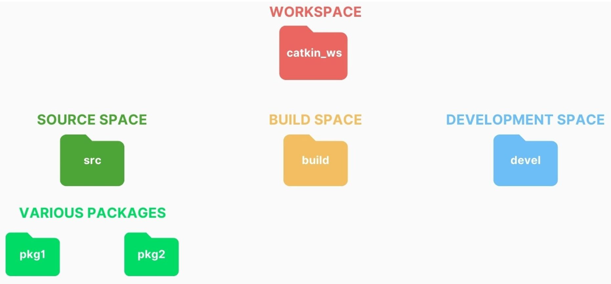
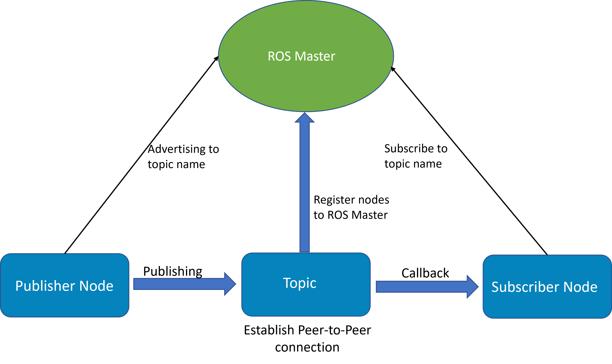

# **Introduction to ROS (Robot Operating System)**

## What is ROS?

It’s a framework or a collection of tools, libraries, and software that helps developers build and control robots.

### Why is ROS important?

✅ **Modularity** : You can break down a robot's tasks into smaller, reusable components (called "nodes").

✅ **Communication** : ROS allows different parts of a robot (like sensors, motors, and cameras) to talk to each other easily.

✅  **Community Support** : Large community with many open-source packages for robotics.

#### Imagine This:

You have a robot with a **camera** and  **wheels** . You want the robot to:

* **See** things with its camera.
* **Move** around and avoid obstacles.

#### The Problem:

Making the camera and wheels work together is  **really tricky** . It’s like trying to get two people who speak different languages to talk to each other. You’d need to write a lot of complicated code to make them understand each other.

#### The Solution: ROS!

ROS is like a  **robot translator** . It helps the camera and wheels talk to each other easily. For example:

* If the camera sees a wall, ROS tells the wheels to stop or turn.
* If the camera sees an open path, ROS tells the wheels to move forward.

### ROS Distributions


## ROS Workspace

A ROS workspace is a **folder** where you keep all your ROS projects, code, and files. It’s where you write, build, and test your robot programs.

#### What’s Inside a ROS Workspace?

1. **src (Source)** : This is where you keep all your robot’s code .
2. **build** : This is where ROS prepares your code to run.
3. **devel** : This is where the finished, ready-to-use programs are stored.
   

### Steps to Create a ROS Workspace:

1. **Open a Terminal**
2. **Create the Workspace Folder** :

* Type the following command to create a new folder for your workspace:

  ```bash
  mkdir -p ~/catkin_ws/src
  ```
* `catkin_ws` is the name of your workspace (you can name it anything you like).
* The `src` folder is where you’ll put your ROS packages (your code).

3. **Navigate to the Workspace** :

* Move into the workspace folder by typing:

  ```bash
  cd ~/catkin_ws
  ```

4. **Initialize the Workspace** :

* Run this command to set up the workspace:

  ```bash
  catkin_init_workspace
  ```

5. **Build the Workspace** :

* Run `catkin_make` to compile the workspace:

  ```bash
  catkin_make
  ```

* [ ] This creates the `build` and `devel` folders inside your workspace.

6. **Source the Workspace** :

* To use your workspace, you need to "activate" it by running:
  ```bash
  source devel/setup.bash
  ```

* [ ] This tells your terminal to use the ROS packages in your workspace.

## ROS Packages

A ROS package is a **folder** that contains all the files, code, and resources needed for a specific task or functionality in your robot.

### Steps to Create a ROS Package:

1. **Navigate to the `src` Folder** :

* Open a terminal and go to the `src` folder inside your workspace:

  ```bash
  cd ~/catkin_ws/src
  ```

2. **Create the Package** :

* Use the `catkin_create_pkg` command to create a new package. For example:

  ```bash
  catkin_create_pkg my_robot std_msgs rospy roscpp
  ```
* `my_robot`: This is the name of your package (you can name it anything).
* `std_msgs rospy roscpp`: These are dependencies (libraries) your package might need. You can add or remove these based on your project.

  3. **Build the Workspace** :

  * Go back to the root of your workspace and build it:

    ```bash
    cd ~/catkin_ws
    catkin_make
    ```

### What’s Inside a ROS Package?

1. **`CMakeLists.txt`** : This file tells ROS how to build your code (like a recipe for compiling).
2. **`package.xml`** : This file contains information about the package, like its name, version, and dependencies (other packages or libraries it needs).
3. **`src/`** : This folder contains your source code (Python, C++, etc.).
4. **`include/`** : This folder is for header files (used in C++).

### `package.xml`

The `package.xml` file is an **XML file** that contains metadata about your ROS package. It includes:

* The package’s name, version, and description.
* Who maintains the package.
* What licenses it uses.
* What other packages (dependencies) it needs to work.

  ```xml
  <?xml version="1.0"?>
  <package format="2">
    <name>my_robot</name>
    <version>0.0.0</version>
    <description>The my_robot package</description>
    <maintainer email="toqa@todo.todo">toqa</maintainer>
    <license>TODO</license>

    <buildtool_depend>catkin</buildtool_depend>
    <build_depend>roscpp</build_depend>
    <build_depend>rospy</build_depend>
    <build_depend>std_msgs</build_depend>
    <build_export_depend>roscpp</build_export_depend>
    <build_export_depend>rospy</build_export_depend>
    <build_export_depend>std_msgs</build_export_depend>
    <exec_depend>roscpp</exec_depend>
    <exec_depend>rospy</exec_depend>
    <exec_depend>std_msgs</exec_depend>

    <!-- The export tag contains other, unspecified, tags -->
    <export>
      <!-- Other tools can request additional information be placed here -->

    </export>
  </package>
  ```

---

### `CMakeLists.txt`

* It is a configuration file used by  **CMake** , a build system generator, to define how a project should be built.

  ```cmake
  # Set the minimum required version of CMake
  cmake_minimum_required(VERSION 3.0.2)

  # Define the project name
  project(my_robot)

  # Find and include catkin and required ROS packages
  find_package(catkin REQUIRED COMPONENTS
    roscpp
    rospy
    std_msgs
  )

  # Declare catkin-specific configurations
  catkin_package(
    # INCLUDE_DIRS include  # Uncomment if your package has header files
    # LIBRARIES my_robot    # Uncomment if you create libraries
    # CATKIN_DEPENDS roscpp rospy std_msgs  # Uncomment if your package depends on these
    # DEPENDS system_lib    # Uncomment if you have system dependencies
  )

  # Specify additional header file locations
  include_directories(
    # include  # Uncomment if you have a custom include directory
    ${catkin_INCLUDE_DIRS}
  )
  ```

1. **`cmake_minimum_required`** : Specifies the minimum version of CMake required to build the project.
2. **`project`** : Defines the name of the project.
3. **`find_package`** : Finds and includes external dependencies (e.g., ROS packages like `roscpp`, `rospy`, and `std_msgs`).
4. **`catkin_package`** : Declares catkin-specific configurations for your package, such as libraries and dependencies.
5. **`include_directories`** : Specifies where CMake should look for header files.
6. **`add_library`** : Declares a C++ library (uncomment and modify if you’re creating a library).
7. **`add_executable`** : Declares a C++ executable (uncomment and modify if you’re creating an executable).
8. **`target_link_libraries`** : Links libraries to your executable or library.

## **ROS Master**

#### **What is ROS Master?**

Think of ROS Master as the "central coordinator" in a ROS system. It helps different parts of your robot communicate with each other. Without the ROS Master, your robot's sensors, motors, and cameras wouldn’t know how to find and talk to each other.

### **How to Start `roscore`**

1. Open a terminal.
2. Run the following command:

   ```bash
   roscore
   ```



## Ros Nodes

### **What is a ROS Node?**

* A **ROS node** is like a worker in a team. Each worker (node) has a specific job to do.
* Nodes are small programs that perform tasks like reading sensor data, controlling motors, or processing information.
* Nodes can talk to each other to share information and work together to achieve a bigger goal.

 **Example** : Imagine a robot that can move and sense its environment. You might have:

* A node to read sensor data (e.g., a camera or laser scanner).
* A node to process that data and make decisions.
* A node to control the robot's motors.

#### **Essential ROS Node Commands**

1️⃣ **Run a node**

```bash
rosrun <package> <node>
```

➝ Starts a specific node.

2️⃣ **List active nodes:**

```bash
rosnode list
```

➝ Shows all running nodes.

3️⃣ **Get node details:**

```bash
rosnode info /node_name
```

➝ Displays the node’s connections and activity.

4️⃣ **Stop a node:**

```bash
rosnode kill /node_name
```

5️⃣ **Check if a node is alive:**

```bash
rosnode ping /node_name
```

➝ Confirms if a node is responsive.

### Understanding ROS Nodes (with Turtlesim Example)

### **1️⃣ Start ROS & Turtlesim Node**

First, open a terminal and start ROS:

```bash
roscore
```

Then, in a new terminal, run the **Turtlesim** node:

```bash
rosrun turtlesim turtlesim_node
```

### **2️⃣ List All Running Nodes**

To see all active nodes, run:

```bash
rosnode list
```

output:

```bash
/rosout  
/turtlesim
```

### **3️⃣ Get Information About a Node**

To see details about the turtlesim node:

```bash
rosnode info /turtlesim
```

output:

```bash
Node [/turtlesim]
Publications: 
 * /rosout [rosgraph_msgs/Log]
 * /turtle1/color_sensor [turtlesim/Color]
 * /turtle1/pose [turtlesim/Pose]

Subscriptions: 
 * /turtle1/cmd_vel [unknown type]

Services: 
 * /clear
 * /kill
 * /reset
 * /spawn
 * /turtle1/set_pen
 * /turtle1/teleport_absolute
 * /turtle1/teleport_relative
 * /turtlesim/get_loggers
 * /turtlesim/set_logger_level
```

### **4️⃣ Move the Turtle (Run Another Node)**

To control the turtle, run this command in a new terminal:

```bash
rosrun turtlesim turtle_teleop_key
```

Now, use the arrow keys to move the turtle.

Check running nodes again:

```bash
rosnode list
```

New output:

```bash
/rosout  
/turtlesim  
/turtle_teleop
```

### **5️⃣ Check If a Node is Active**

To test if the **/turtlesim** node is running:

```bash
rosnode ping /turtlesim
```

### **6️⃣ Stop a Node**

To stop the **teleop** node:

```bash
rosnode kill /turtle_teleop
```

Try listing nodes again:

Now, only **/turtlesim** remains.

## ROS Topics

A **ROS topic** is a communication channel that nodes use to exchange data. One node **publishes** data to a topic, while other nodes **subscribe** to receive it.

### ROS topic Commands

### **1️⃣ List All Available Topics**

To see all active topics, run:

```bash
rostopic list
```

### 2️⃣ **Get topic details:**

```bash
rostopic info /topic_name
```

➝ Displays information about a topic, including publishers, subscribers, and message type.

### 3️⃣ **View live topic data:**

```bash
rostopic echo /topic_name
```

➝ Prints real-time messages being published on a topic.

### 4️⃣ **Publish data to a topic:**

```bash
rostopic pub /topic_name msg_type '{data}'
```

### 5️⃣ **Check topic message type:**

```bash
rostopic type /topic_name
```

➝ Shows the data type used for messages on a topic.

### 6️⃣ Monitor topic publishing rate:

```bash
rostopic hz /topic_name
```


### Understanding ROS Topics (with Turtlesim Example)

###  1️⃣ **List active topics:**

```shell
rostopic list
```

output:

```shell
/rosout
/rosout_agg
/turtle1/cmd_vel
/turtle1/color_sensor
/turtle1/pose
```

### 2️⃣ **Get topic details:**

```bash
rostopic info /turtle1/pose
```

output:

```bash
Type: turtlesim/Pose

Publishers: 
 * /turtlesim (http://192.168.100.6:40021/)

Subscribers: None
```

### 3️⃣ **View live topic data:**

```shell
rostopic echo /turtle1/cmd_vel
```

output:

```shell
linear: 
  x: 0.0
  y: 0.0
  z: 0.0
angular: 
  x: 0.0
  y: 0.0
  z: -2.0
```

### 4️⃣ Check topic message type:

```
rostopic type /turtle1/cmd_vel 
```

output

```
geometry_msgs/Twist
```

### **5️⃣ Publish data to a topic (move the turtle):**

**`rostopic pub [topic] [msg_type] [args]`** :

Moving the Turtle **`Once`**

```shell
rostopic pub -1 /turtle1/cmd_vel geometry_msgs/Twist "linear:
  x: 2.0
  y: 1.0
  z: 0.0
angular:
  x: 0.0
  y: 0.0
  z: 0.0" 
```


## Ros Messages

* A **node** sends information to another **node** using  **messages** .
* These messages are sent over **topics** (like communication channels).
* Each message has a **simple structure** made up of standard data types  or custom types created by the user.

#### **Types of ROS Messages**

##### 1️⃣ **Standard Messages (Built-in in ROS)**

ROS provides a set of standard message types that are commonly used across different applications. Some of the most used standard messages include:**

* **`std_msgs/String`** → Used for text messages.
* **`std_msgs/Int32`** → Sends an integer value.
* **`geometry_msgs/Twist`** → Defines linear and angular velocity (used for movement commands).
* **`sensor_msgs/LaserScan`** → Used for LiDAR data.
* **`nav_msgs/Odometry`** → Contains robot position and velocity data.

##### 2️⃣ **Custom Messages**

If standard messages do not fit your needs, you can **create custom messages** by defining a `.msg` file with the required fields. Custom messages allow you to structure your data based on your application requirements.

### **Essential ROS Message Commands**

#### 1️⃣ **List all available message types:**

```bash
rosmsg list
```

➝ Displays all message types installed in your ROS environment.

#### 2️⃣ **Check the structure of a message type:**

```bash
rosmsg show msg_type
```

➝ Displays the fields and data types of a specific message.

#### 3️⃣ **Find message types in a package:**

```bash
rosmsg package <package_name>
```

➝ Lists all messages defined within a specific package.

#### 4️⃣ **Check the message type used by a topic:**

```bash
rostopic type /topic_name
```

## ROS Publisher and Subscriber

Imagine you are in a classroom:

* **Publisher** : The teacher who is speaking (publishing information) to the class.
* **Subscriber** : The students who are listening (subscribing) to the teacher.
* **Topic** : The subject being taught (e.g., "Math" or "Science"). Only students interested in that subject will listen.
* **Message** : The actual words or content the teacher is saying.

In ROS:

* A **Publisher** sends data (messages) to a specific  **Topic** .
* A **Subscriber** listens to that **Topic** and processes the data (messages) it receives.

## Publisher

#### **1. Python: `rospy.Publisher()`**

```python
pub = rospy.Publisher(topic_name, message_type, queue_size)
```

#### **Parameters**

* **`topic_name`** : The name of the topic to publish to (e.g., `"chatter"`).
* **`message_type`** : The type of message to publish (e.g., `String` from `std_msgs.msg`).
* **`queue_size`** : The number of messages to buffer if the subscriber is slow .

#### **2. C++: `ros::Publisher`**

```cpp
ros::Publisher pub = nh.advertise<message_type>(topic_name, queue_size);
```

#### **Parameters**

* **`message_type`** : The type of message to publish (e.g., `std_msgs::String`).
* **`topic_name`** : The name of the topic to publish to (e.g., `"chatter"`).
* **`queue_size`** : The number of messages to buffer


### **Example** 

Here’s a simple Python publisher (`talker.py`) that publishes a `String` message to the `chatter` topic:

```python
#!/usr/bin/env python
import rospy
from std_msgs.msg import String  # Import the String message type

def talker():
    # Initialize the ROS node with a name, "talker"
    rospy.init_node('talker', anonymous=True)
  
    # Create a Publisher object
    # - Topic name: "chatter"
    # - Message type: String
    # - Queue size: 10 (number of messages to buffer)
    pub = rospy.Publisher('chatter', String, queue_size=10)
  
    # Set the publishing rate (10 messages per second)
    rate = rospy.Rate(10)
  
    # Keep publishing until the node is shut down
    while not rospy.is_shutdown():
        # Create the message
        hello_str = "Hello, Zewail City students! Time: %s" % rospy.get_time()
  
        # Publish the message
        pub.publish(hello_str)
  
        # Log the message (print to terminal)
        rospy.loginfo(hello_str)
  
        # Sleep to maintain the publishing rate
        rate.sleep()

if __name__ == '__main__':
    try:
        talker()
    except rospy.ROSInterruptException:
        pass
```

## Subscriber

#### **1. Python: `rospy.Subscriber()`**

```python
sub = rospy.Subscriber(topic_name, message_type, callback, queue_size)
```

#### **Parameters**

* **`topic_name`** : The name of the topic to subscribe to (e.g., `"chatter"`).
* **`message_type`** : The type of message to receive (e.g., `String` from `std_msgs.msg`).
* **`callback`** : The function to call when a new message is received.
* **`queue_size`** : The number of messages to buffer if the subscriber is slow (optional, default is `None`).

#### **2. C++: `ros::Subscriber`**

```cpp
ros::Subscriber sub = nh.subscribe(topic_name, queue_size, callback);
```

#### **Parameters**

* **`topic_name`** : The name of the topic to subscribe to (e.g., `"chatter"`).
* **`queue_size`** : The number of messages to buffer if the subscriber is slow.
* **`callback`** : The function to call when a new message is received.


## **Example: Python Subscriber**

### Code: `listener.py`

```python
#!/usr/bin/env python
import rospy
from std_msgs.msg import String  # Import the String message type

def callback(msg):
    # This function is called whenever a new message is received
    rospy.loginfo(f"Received: {msg.data}")

def listener():
    # Initialize the ROS node
    rospy.init_node('listener', anonymous=True)
  
    # Create a Subscriber object
    # - Topic name: "chatter"
    # - Message type: String
    # - Callback function: callback (called when a message is received)
    # - Queue size: 10 (number of messages to buffer)
    rospy.Subscriber('chatter', String, callback, queue_size=10)
  
    # Keep the node running
    rospy.spin()

if __name__ == '__main__':
    listener()
```


#### **Steps to Modify `CMakeLists.txt` for Python Scripts**

#### **For Python Scripts**

Add the following lines to your `CMakeLists.txt` file to install and mark your Python scripts as executable:

```cmake
# Install Python scripts
catkin_install_python(PROGRAMS
  scripts/talker.py
  scripts/listener.py
  DESTINATION ${CATKIN_PACKAGE_BIN_DESTINATION}
)
```


# ROS Launch Files

## **What is a Launch File?**

A **launch file** is an XML file that automates the process of starting ROS nodes, setting parameters, and configuring your system. It’s like a script that makes your life easier!

---

## **Why Use Launch Files?**

### **1. Save Time**

Instead of running multiple commands like:

```bash
roscore &
rosrun my_package talker.py &
rosrun my_package listener.py &
```

You can start everything with a  **single command** :

```bash
roslaunch my_package my_launch_file.launch
```

### **2. Automatically Start the ROS Master**

* When you run a launch file, it **automatically starts `roscore`** if it’s not already running.
* No need to manually run `roscore` in a separate terminal!


## **Basic Structure**

A launch file is written in XML and looks like this:

```xml
<launch>
    <!-- Nodes, parameters, and other elements go here -->
</launch>
```


## **Key Elements**

### **1. `<node>`**

Starts a ROS node.

```xml
<node pkg="my_package" type="my_node.py" name="my_node" output="screen" />
```

* `pkg`: The package name.
* `type`: The executable name.
* `name`: The node name.
* `output`: Where to send output (`screen` or `log`).
