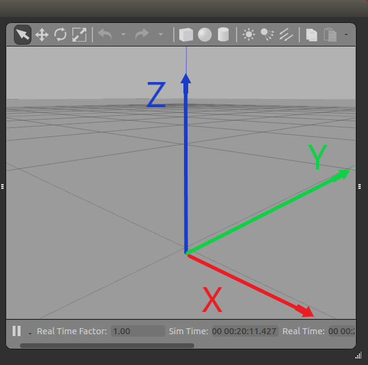

# Gazebo 

Gazebo is a powerful open-source robotics simulator that is widely used for testing and developing robotics applications

## Checking Gazebo Version

To check the version of Gazebo installed on your system, you can use the following command in your terminal:

```bash
gazebo --version
```

This command will output the version of Gazebo currently installed on your system.

## Installing Gazebo (If not installed )

* Use this link :

[Gazebo ROS Installation Tutorial](https://classic.gazebosim.org/tutorials?tut=ros_installing&cat=connect_ros)

## Starting Gazebo

To start Gazebo, simply run:

```
gazebo
```

This will launch the Gazebo GUI where you can load models, simulate environments, and interact with robots.


## Coordinates in Gazebo

Gazebo uses a right-handed coordinate system:

* **X-axis:** Forward
* **Y-axis:** Left
* **Z-axis:** Up




## **TurtleBot3**

### **What is TurtleBot3?**

TurtleBot3 is a small, affordable, and programmable robot designed for learning and experimenting with ROS (Robot Operating System). It is equipped with sensors, actuators, and a modular design, making it ideal for beginners and advanced users alike.


## **Using TurtleBot3 in Gazebo**

Gazebo provides a realistic simulation environment for TurtleBot3, allowing you to test algorithms and behaviors without needing a physical robot.

---

### **Step 1: Install TurtleBot3 Simulation Packages**

If you haven’t already, install the TurtleBot3 simulation packages for your ROS distribution. For example, on ROS Noetic:

```bash
sudo apt-get install ros-noetic-turtlebot3-simulations ros-noetic-turtlebot3-gazebo
```

---

### **Step 2: Set the TurtleBot3 Model**

Before launching the simulation, specify which TurtleBot3 model you want to use. For example, to use the **Burger** model:

```bash
export TURTLEBOT3_MODEL=burger
```

You can replace `burger` with `waffle` or `waffle_pi` for the other models.

---

### **Step 3: Launch Gazebo with TurtleBot3**

Launch a Gazebo simulation with TurtleBot3 in an empty world:

```bash
roslaunch turtlebot3_gazebo turtlebot3_empty_world.launch
```

This will start Gazebo and spawn the selected TurtleBot3 model in an empty environment.

---

### **Step 4: Control TurtleBot3**

You can control TurtleBot3 using the keyboard:

```bash
rosrun teleop_twist_keyboard teleop_twist_keyboard.py 
```


### **Step 5: Explore Other Worlds**

TurtleBot3 simulations come with pre-built worlds. For example:

```bash
roslaunch turtlebot3_gazebo turtlebot3_world.launch
```
