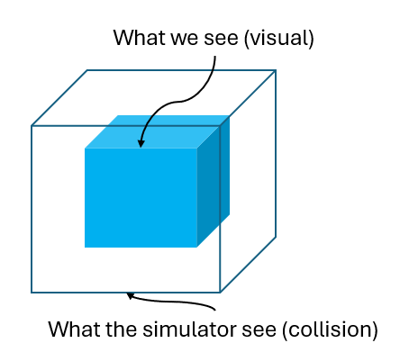
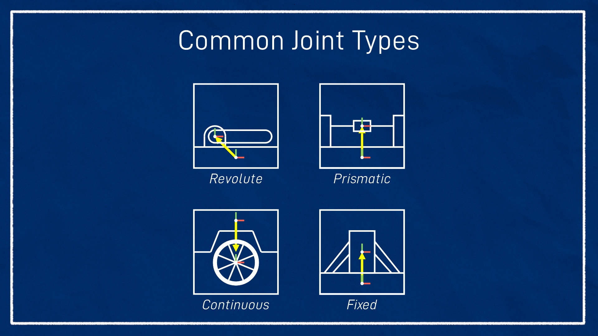

# URDF

URDF (Unified Robot Description Format) is an XML-based file format used in robotics to describe the physical and kinematic properties of a robot.

It is primarily used in ROS to define robot models for:

* **Simulation** : Tools like Gazebo use URDF to simulate robot behavior.
* **Visualization** : Tools like RViz use URDF to visualize robot models.
* **Control** : URDF defines the kinematic structure of the robot, which is essential for motion planning and control.

## What Does URDF Contain?

A URDF file contains the following key components:

1. **`<robot>`** : The root element that encapsulates the entire robot model.
2. **`<link>`** : Represents a rigid body or component of the robot (e.g., base, wheels, arms).
3. **`<joint>`** : Defines the relationship between two links (e.g., how they move relative to each other).

### **Before Starting: Install VSCode Extensions**

To work with URDF files, install these  **VSCode extensions** :

1. **ROS by Microsoft**
   * Main ROS extension with **URDF preview** for visualizing robots.
2. **ROS Snippets by pjir**
   * Provides **code snippets** for URDF (e.g., `<link>`, `<joint>`).
3. **URDF by smilerobotics**
   * Offers **premade URDF structures** for faster coding.
4. **XML Tools by Josh Johnson** (Optional)
   * Helps with XML formatting and validation.

## **Structure of a URDF File**

### **1. XML Declaration**

Every URDF file starts with an  **XML declaration** :

```xml
<?xml version="1.0"?>
```

### **2. `<robot>` Tag**

The `<robot>` tag is the **root element** of the URDF file. It encapsulates all the components of the robot.

* **`name`** : A unique name for the robot (e.g., `my_robot`).

  ```xml
  <robot name="my_robot">
    <!-- Links and joints go here -->
  </robot>
  ```

## **Key Components of URDF**

A URDF file primarily consists of two main components:

1. **`<link>`** : Represents a rigid body or part of the robot.
2. **`<joint>`** : Defines the relationship between two links (e.g., how they move relative to each other).

---

### **1. `<link>` Tag**

A `<link>` represents a **rigid body** or component of the robot. It can contain the following elements:

1. **`<visual>`** : Describes how the link looks in visualization tools.
2. **`<collision>`** : Defines the geometry used for collision detection.
3. **`<inertial>`** : Specifies the mass and inertia of the link for physics simulation.


```xml
<link name="link_name">
  <visual>
  </visual>

  <collision>
  </collision>

  <inertial> 
  </inertial>
</link>
```

Let’s go through each element in detail.

---

### **1. `<visual>` Element**

The `<visual>` element defines how the link **appears** in visualization tools like RViz. It includes:

* **`<geometry>`** : The shape of the link (e.g., box, cylinder, sphere, mesh).
* **`<material>`** : The color or texture of the link.
* **`<origin>`** : The position and orientation of the visual element.

#### Example:

```xml
<visual>
  <geometry>
    <box size="0.5 0.5 0.1"/>
  </geometry>
  <material name="blue">
    <color rgba="0 0 1 1"/>
  </material>
  <origin xyz="0 0 0" rpy="0 0 0"/>
</visual>
```

* **`<geometry>`** : The link is a box with dimensions `0.5m x 0.5m x 0.1m`.
* **`<material>`** : The link is colored blue (`rgba="0 0 1 1"`).
* **`<origin>`** : The visual element is centered at `(0, 0, 0)` with no rotation.

### **`<geometry>`**

`<geometry>` tag is used to define the **shape** of a link. It can be used in both the `<visual>` and `<collision>` sections of a `<link>`. The `<geometry>` tag supports several basic shapes and also allows the use of **3D meshes** for more complex models.

1. **Box**
   * Defines a rectangular box.
   * Attributes:

     * `size`: The dimensions of the box (length, width, height).
   * Example:

     ```xml
     <geometry>
       <box size="0.5 0.5 0.1"/>
     </geometry>
     ```
2. **Cylinder**
   * Defines a cylinder.
   * Attributes:

     * `radius`: The radius of the cylinder.
     * `length`: The height of the cylinder.
   * Example:

     ```xml
     <geometry>
       <cylinder radius="0.2" length="0.1"/>
     </geometry>
     ```
3. **Sphere**
   * Defines a sphere.
   * Attributes:

     * `radius`: The radius of the sphere.
   * Example:

     ```xml
     <geometry>
       <sphere radius="0.1"/>
     </geometry>
     ```
4. **Mesh**
   * Allows you to use a 3D model (e.g., STL,dae) for complex shapes.
   * Attributes:

     * `filename`: The path to the mesh file.
   * Example:

     ```xml
     <geometry>
       <mesh filename="package://my_robot/meshes/wheel.stl"/>
     </geometry>
     ```

---

### **2. `<collision>` Element**

The `<collision>` element defines the **collision geometry** of the link. It is used in physics simulations like Gazebo to detect collisions. It includes:

* **`<geometry>`** : The shape of the collision geometry.
* **`<origin>`** : The position and orientation of the collision element.

#### Example:

```xml
<collision>
  <geometry>
    <box size="0.5 0.5 0.1"/>
  </geometry>
  <origin xyz="0 0 0" rpy="0 0 0"/>
</collision>
```

* **`<geometry>`** : The collision geometry is a box with the same dimensions as the visual geometry.
* **`<origin>`** : The collision element is centered at `(0, 0, 0)` with no rotation.



## **Key Differences Between `<visual>` and `<collision>`**

| Feature                      | `<visual>`                    | `<collision>`                   |
| ---------------------------- | ------------------------------- | --------------------------------- |
| **Purpose**            | Defines how the robot looks.    | Defines collision detection.      |
| **Geometry**           | Can be detailed (e.g., meshes). | Should be simple for performance. |
| **Performance Impact** | Minimal impact on simulation.   | Affects simulation performance.   |
| **Example Use Case**   | Realistic rendering in RViz.    | Physics interactions in Gazebo.   |

---

### **3. `<inertial>` Element**

The `<inertial>` element defines the **mass and inertia** of the link. It is used in physics simulations to calculate how the link moves and reacts to forces. It includes:

* **`<mass>`** : The mass of the link.
* **`<inertia>`** : The 3x3 inertia matrix.
* **`<origin>`** : The center of mass of the link.

#### Example:

```xml
<inertial>
  <mass value="10"/>
  <origin xyz="0 0 0.05"/>
  <inertia ixx="0.1" ixy="0" ixz="0" iyy="0.1" iyz="0" izz="0.1"/>
</inertial>
```

* **`<mass>`** : The link has a mass of `10 kg`.
* **`<origin>`** : The center of mass is at `(0, 0, 0.05)`.
* **`<inertia>`** : The inertia matrix defines how the mass is distributed.

---

## **Complete Example of a `<link>`**

Here’s a complete example of a `<link>` with all three elements:

```xml
<link name="base_link">
  <!-- Visual Properties -->
  <visual>
    <geometry>
      <box size="0.5 0.5 0.1"/>
    </geometry>
    <material name="blue">
      <color rgba="0 0 1 1"/>
    </material>
    <origin xyz="0 0 0" rpy="0 0 0"/>
  </visual>

  <!-- Collision Properties -->
  <collision>
    <geometry>
      <box size="0.5 0.5 0.1"/>
    </geometry>
    <origin xyz="0 0 0" rpy="0 0 0"/>
  </collision>

  <!-- Inertial Properties -->
  <inertial>
    <mass value="10"/>
    <origin xyz="0 0 0.05"/>
    <inertia ixx="0.1" ixy="0" ixz="0" iyy="0.1" iyz="0" izz="0.1"/>
  </inertial>
</link>
```

## 2. `<joint>`

## **What is a Joint in URDF?**

A **joint** in URDF defines the  **relationship between two links** :

* It specifies how one link (the  **child** ) moves relative to another link (the  **parent** ).
* Joints are used to describe the **kinematic structure** of the robot (e.g., how wheels are attached to the chassis, how arms rotate, etc.).


To create joint 

### **1-  `<joint>` Tag**

Every joint in URDF starts with the `<joint>` tag. It has two required attributes:

* **`name`** : A unique name for the joint (e.g., `my_joint`).
* **`type`** : The type of joint (e.g., `fixed`, `revolute`, `continuous`, `prismatic`).

```xml
<joint name="my_joint" type="joint_type">
  <!-- Joint properties go here -->
</joint>
```


### **2-Define Parent and Child Links**

Every joint connects two links:

* **`<parent>`** : The reference link (e.g., the base of the robot).
* **`<child>`** : The link that moves relative to the parent (e.g., a wheel or arm).

Add the `<parent>` and `<child>` tags inside the `<joint>` tag:


```xml
<joint name="my_joint" type="joint_type">
  <parent link="base_link"/>
  <child link="child_link"/>
</joint>
```


### **3- Specify the Joint Origin**

The `<origin>` tag defines the **position and orientation** of the joint relative to the parent link.

* **`xyz`** : The position (x, y, z) in meters.
* **`rpy`** : The orientation (roll, pitch, yaw) in radians.

#### Example:

```xml
<joint name="my_joint" type="joint_type">
  <parent link="base_link"/>
  <child link="child_link"/>
  <origin xyz="0 0.2 0" rpy="0 0 0"/>
</joint>
```

* This places the joint `0.2 meters` above the parent link along the Y-axis with no rotation.

---

### **4- Define the Joint Axis**

The `<axis>` tag defines the **axis of rotation or translation** for the joint.

* **`xyz`** : The direction of the axis (x, y, z).
* For example, `<axis xyz="0 1 0"/>` means the joint rotates or moves along the Y-axis.

#### Example:

```xml
<joint name="my_joint" type="joint_type">
  <parent link="base_link"/>
  <child link="child_link"/>
  <origin xyz="0 0.2 0" rpy="0 0 0"/>
  <axis xyz="0 1 0"/>
</joint>
```


### 5- *Choose the Joint Type*

The **`type`** attribute of the `<joint>` tag defines the type of joint. There are **six types of joints** in URDF:

1. **Fixed** : No movement between links.
2. **Revolute** : Rotational movement around a single axis (limited range).
3. **Continuous** : Rotational movement around a single axis (unlimited range).
4. **Prismatic** : Linear movement along a single axis.



---


If the joint type is prismatic or revolute then the a limit should be add tho the joint in which the limit has four parameters.

* 1- `lower` : This parameter value is for the lower limit in *meters* for **parasmitic joint** and *radian* for  **revolute joint** .
* 2- `upper` : This parameter value is for the upper limit in *meters* for **parasmitic joint** and *radian* for  **revolute joint** .
* 3- `effort` : This parameter value is for the maximum effort in *N* for the **prismatic joint** and *N-m* for the  **revolute joint** .
* 4- `velocity`: This parameter value is for the maximum velocity in *m/sec* for **prismatic joint** and *rad/sec* for  **revolute joint** .

```xml
<joint name="joint_name" type="joint_type">
   <origin xyz="0.0 0.0 0.0" rpy="0.0 0.0 0.0"/>
   <parent link="parent_link"/>
   <child link="child_link"/>
   <axis xyz="0.0 0.0 0.0"/>
   <limit lower="0.0" upper="0.0" effort="0.0" velocity="0.0"/>
</joint>
```


## **What is Xacro?**

Xacro (XML Macros) is a **tool** that makes URDF files  **easier to write and manage** . It adds features like:

1. **Reusable components** : Write a piece of code once and reuse it.
2. **Variables** : Use variables to avoid hardcoding values.
3. **File inclusion** : Break your URDF into smaller files and include them.
4. **Math and logic** : Do calculations and use conditions.

Xacro files are **preprocessed** into URDF files before ROS uses them.

---

## **Why Use Xacro?**

Writing URDF files can get **messy** and  **repetitive** . For example:

* If your robot has 4 wheels, you’d have to write the same code 4 times in URDF.
* If you want to change the wheel size, you’d have to update it in 4 places.

Xacro solves these problems by making URDF files:

* **Shorter** : Less code to write.
* **Easier to maintain** : Change one value, and it updates everywhere.
* **More organized** : Break your robot description into smaller files.

---

## **Key Features of Xacro**

Let’s go through the main features with  **simple examples** .

---

### **1. Macros (Reusable Components)**

Macros let you define a **block of code** and reuse it. For example, you can define a **wheel** once and reuse it for all wheels.

#### Example: Wheel Macro

```xml
<xacro:macro name="wheel" params="name parent_link xyz">
  <link name="${name}_link">
    <visual>
      <geometry>
        <cylinder radius="0.1" length="0.05"/>
      </geometry>
    </visual>
  </link>

  <joint name="${name}_joint" type="continuous">
    <parent link="${parent_link}"/>
    <child link="${name}_link"/>
    <origin xyz="${xyz}"/>
    <axis xyz="0 1 0"/>
  </joint>
</xacro:macro>
```


#### Using the Macro

```
<xacro:wheel name="left_wheel" parent_link="base_link" xyz="0 0.3 0"/>
<xacro:wheel name="right_wheel" parent_link="base_link" xyz="0 -0.3 0"/>
```

* Instead of writing the wheel code twice, you define it once and reuse it.

---

### **2. Variables**

Variables let you **store values** and use them in your URDF. This makes your code **flexible** and  **easy to update** .

#### Example: Using Variables

```xml
<xacro:property name="wheel_radius" value="0.1"/>
<xacro:property name="wheel_length" value="0.05"/>

<link name="wheel_link">
  <visual>
    <geometry>
      <cylinder radius="${wheel_radius}" length="${wheel_length}"/>
    </geometry>
  </visual>
</link>
```

* If you want to change the wheel size, just update the variables.

---

### **3. File Inclusion**

You can break your robot description into **smaller files** and include them in a main file.

#### Example: Including a File

xml

Copy

```
<xacro:include filename="$(find my_robot_description)/urdf/wheel.xacro"/>
```

Run HTML

* This includes the `wheel.xacro` file in your main URDF file.

---

### **4. Math and Logic**

Xacro lets you do **math** and use **conditions** to make your URDF smarter.

#### Example: Math

```
<xacro:property name="wheel_radius" value="0.1"/>
<xacro:property name="wheel_mass" value="1"/>

<link name="wheel_link">
  <inertial>
    <mass value="${wheel_mass}"/>
    <inertia ixx="${wheel_mass * wheel_radius * wheel_radius / 2}" ixy="0" ixz="0" 
             iyy="${wheel_mass * wheel_radius * wheel_radius / 2}" iyz="0" 
             izz="${wheel_mass * wheel_radius * wheel_radius / 2}"/>
  </inertial>
</link>
```

* Here, the inertia is calculated using math.

#### Example: Conditions

```xml
<xacro:property name="use_gazebo" value="true"/>

<xacro:if value="${use_gazebo}">
  <gazebo reference="base_link">
    <material>Gazebo/Blue</material>
  </gazebo>
</xacro:if>
```


* This adds Gazebo properties only if `use_gazebo` is `true`.

---

## **Example: Simple Xacro File**

Here’s a complete example of a Xacro file for a robot with two wheels:


```xml
<?xml version="1.0"?>
<robot xmlns:xacro="http://www.ros.org/wiki/xacro" name="simple_robot">

  <!-- Define properties -->
  <xacro:property name="wheel_radius" value="0.1"/>
  <xacro:property name="wheel_length" value="0.05"/>

  <!-- Define a wheel macro -->
  <xacro:macro name="wheel" params="name parent_link xyz">
    <link name="${name}_link">
      <visual>
        <geometry>
          <cylinder radius="${wheel_radius}" length="${wheel_length}"/>
        </geometry>
      </visual>
    </link>

    <joint name="${name}_joint" type="continuous">
      <parent link="${parent_link}"/>
      <child link="${name}_link"/>
      <origin xyz="${xyz}"/>
      <axis xyz="0 1 0"/>
    </joint>
  </xacro:macro>

  <!-- Base Link -->
  <link name="base_link">
    <visual>
      <geometry>
        <box size="0.5 0.5 0.1"/>
      </geometry>
    </visual>
  </link>

  <!-- Add Wheels -->
  <xacro:wheel name="left_wheel" parent_link="base_link" xyz="0 0.3 0"/>
  <xacro:wheel name="right_wheel" parent_link="base_link" xyz="0 -0.3 0"/>
</robot>
```
