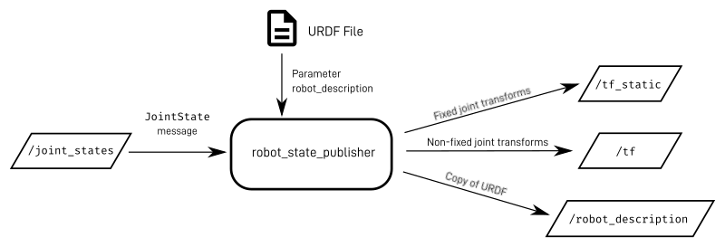

# **Transformations (TF) in Robotics**

## **1. What is a Transformation (TF)?**

In robotics, a **transformation (TF)** defines the relationship between different  **coordinate frames** . Each frame has its own **origin** and  **coordinate system** , which describes the position and orientation of objects relative to that frame. Transformations are used to convert data (e.g., positions, orientations) from one frame to another.

#### For example:

* If a robot has a camera and an arm, the camera might detect an object in its own frame, but the arm needs to know the object's position relative to its own frame to pick it up. Transformations allow us to bridge this gap.
  

#### In this Example

1. The **camera** detects an object at `(1, 1)` in its frame (`sensor_link`).
2. To pick it up, the **arm** needs the object's position in its frame (`arm_end_link`).
3. **Transformations** convert the object's position:
   * From `sensor_link` → `base_link` (robot base).
   * From `base_link` → `arm_base_link` (arm base).
   * From `arm_base_link` → `arm_end_link` .

After these transformations, we know the relationship between the **sensor_link** (camera) and the **arm_end_link** (arm end-effector), allowing the arm to accurately pick up the object.

## **Main Frames**

### **1. `map` Frame**

* The **global reference frame** for the environment.
* Represents a fixed, world-fixed coordinate system (e.g., the room or workspace).

### **2. `odom` Frame**

* The  **odometry frame** .
* Represents the robot's position and orientation as estimated by its odometry sensors (e.g., wheel encoders, IMU).

### **3. `base_link` Frame**

* The  **robot's base frame** .
* Represents the position and orientation of the robot's base (e.g., the center of the robot).
* All other frames (e.g., `camera_frame`, `arm_frame`) are defined relative to `base_link`.

### **Relationship Between Frames**

1. The **`map` frame** is the most global frame.
2. The **`odom` frame** is a local frame updated based on the robot's movement.
3. The **`base_link` frame** is the robot's own frame, which moves relative to `odom` and `map`.

## TF in ROS

tf is a package manage **transformations** between different **coordinate frames** in a robot system. It allows you to:

1. Define the **position** and **orientation** of one frame relative to another.
2. Look up transformations between frames at any point in time.
3. Broadcast transformations dynamically as the robot moves.

## **1. `tf` (ROS 1)**

* The original TF library used in  **ROS 1** .
* Provides tools for managing transformations between coordinate frames.
* Key components:
  * **`tf::TransformBroadcaster`** : Publishes transformations.
  * **`tf::TransformListener`** : Listens to and retrieves transformations.
  * **`tf::Transformer`** : Handles the TF tree and transformations.

---

## **2. `tf2` (ROS 1 and ROS 2)**

* The **modern and improved version** of TF, used in both **ROS 1** and  **ROS 2** .
* Designed to be more efficient, flexible, and thread-safe.
* Key components:
  * **`tf2_ros::TransformBroadcaster`** : Publishes transformations.
  * **`tf2_ros::TransformListener`** : Listens to and retrieves transformations.
  * **`tf2_ros::Transform`** : Represents a transformation (translation + rotation).

Certainly! ROS provides several **TF tools** to help you work with transformations and debug coordinate frames. These tools are essential for visualizing, inspecting, and troubleshooting the TF system. Here's a concise overview:

---

## **TF Tools in ROS**

### **1. `tf_monitor`**

- **Purpose**: Monitors the TF tree and reports the relationships between frames.
- **Usage**:
  ```bash
  rosrun tf tf_monitor
  ```
- **What it does**:
  - Lists all frames in the TF tree.
  - Shows the update rate and delay for each frame.

---

### **2. `tf_echo`**

- **Purpose**: Prints the transformation between two specific frames.
- **Usage**:
  ```bash
  rosrun tf tf_echo <source_frame> <target_frame>
  ```
- **Example**:
  ```bash
  rosrun tf tf_echo base_link camera_frame
  ```
- **What it does**:
  - Displays the translation and rotation between the two frames in real-time.

---

### **3. `rqt_tf_tree`**

* **Purpose**:It shows the relationships between coordinate frames and helps you understand how frames are connected in your ROS system.
* **Usage**:

  ```bash
  rosrun rqt_tf_tree rqt_tf_tree
  ```

If you don't have `rqt_tf_tree` installed, you can install it using:

```bash
sudo apt-get install ros-noetic-rqt-tf-tree
```

---

### **4. `static_transform_publisher`**

- **Purpose**: Publishes a static transformation between two frames.
- **Usage**:
  ```bash
  rosrun tf static_transform_publisher x y z yaw pitch roll frame_id child_frame_id period_in_ms
  ```
- **Example**:
  ```bash
  rosrun tf static_transform_publisher 0.5 0 0 0 0 0 base_link camera_frame 100
  ```
- **What it does**:
  - Publishes a fixed transformation (e.g., the camera is 0.5 meters in front of the base).

---

### **5. `tf_remap`**

- **Purpose**: Remaps TF frame names dynamically.
- **Usage**:
  ```bash
  rosrun tf tf_remap <old_frame> <new_frame>
  ```
- **What it does**:
  - Allows you to rename frames in the TF tree (useful for integrating multiple systems).

---

Now that you understand **TF (Transformations)** and have created your robot's **URDF (Unified Robot Description Format)**

### **Robot State Publisher**

* The **Robot State Publisher** package allows you to publish the state of your robot to  **TF2** .
* It reads the robot’s **URDF** (Unified Robot Description Format) and **joint states** (e.g., joint positions, velocities) to compute and publish the **transformations** between all the robot’s links.

### **How to Use Robot State Publisher**

Add the following to your launch file:

```xml
<node name="robot_state_publisher" pkg="robot_state_publisher" type="robot_state_publisher">
  <param name="robot_description" value="$(arg robot_description)"/>
</node>
```

### **What is Joint State Publisher?**

* **Joint State Publisher** is a ROS node that publishes the **joint states** of your robot (e.g., joint positions, velocities).
* Publishes joint states for **non-fixed joints** (e.g.,continuous).
* It reads the URDF to determine the robot’s joints and publishes their states to the **`/joint_states`** topic.



### **How to Use Joint State Publisher**

#### **Standard Joint State Publisher**

Add the following to your launch file:

```xml
<node name="joint_state_publisher" pkg="joint_state_publisher" type="joint_state_publisher">
  <param name="robot_description" value="$(arg robot_description)"/>
</node>
```

##### **Joint State Publisher GUI**

* A **GUI version** of the Joint State Publisher.
* Provides sliders to **manually control** the positions of non-fixed joints.
* Useful for **testing** and **debugging** your robot’s kinematics.

#### **Joint State Publisher GUI**

Add the following to your launch file:

```xml
<node name="joint_state_publisher_gui" pkg="joint_state_publisher" type="joint_state_publisher_gui">
  <param name="robot_description" value="$(arg robot_description)"/>
</node>
```

Got it! Here's a **clear and concise explanation** of how to bring your differential drive robot to life in Gazebo, including adding the **differential drive plugin**, integrating it into your Xacro file, and spawning the robot in Gazebo:

---

## **Steps to Bring Your Robot to Life in Gazebo**

### **1. Add the Differential Drive Plugin**

To enable your robot to move in Gazebo, you need to add the **differential drive plugin**. This plugin simulates a robot with two independently driven wheels.

#### **Create a `.gazebo` File**

Create a `.gazebo` file (e.g., `my_robot.gazebo`) and add the following plugin configuration:

```xml
<gazebo>
  <plugin name="differential_drive_controller" filename="libgazebo_ros_diff_drive.so">

    <!-- Plugin update rate in Hz -->
    <updateRate>50</updateRate>

    <!-- Name of left joint, defaults to `left_joint` -->
    <leftJoint>base_link_left_wheel_joint</leftJoint>

    <!-- Name of right joint, defaults to `right_joint` -->
    <rightJoint>base_link_right_wheel_joint</rightJoint>

    <!-- The distance from the center of one wheel to the other, in meters, defaults to 0.34 m -->
    <wheelSeparation>0.5380</wheelSeparation>

    <!-- Diameter of the wheels, in meters, defaults to 0.15 m -->
    <wheelDiameter>0.2410</wheelDiameter>

    <!-- Wheel acceleration, in rad/s^2, defaults to 0.0 rad/s^2 -->
    <wheelAcceleration>1.0</wheelAcceleration>

    <!-- Maximum torque which the wheels can produce, in Nm, defaults to 5 Nm -->
    <wheelTorque>20</wheelTorque>

    <!-- Topic to receive geometry_msgs/Twist message commands, defaults to `cmd_vel` -->
    <commandTopic>cmd_vel</commandTopic>

    <!-- Topic to publish nav_msgs/Odometry messages, defaults to `odom` -->
    <odometryTopic>odom</odometryTopic>

    <!-- Odometry frame, defaults to `odom` -->
    <odometryFrame>odom</odometryFrame>

    <!-- Robot frame to calculate odometry from, defaults to `base_footprint` -->
    <robotBaseFrame>base_footprint</robotBaseFrame>

    <!-- Odometry source, 0 for ENCODER, 1 for WORLD, defaults to WORLD -->
    <odometrySource>1</odometrySource>

    <!-- Set to true to publish transforms for the wheel links, defaults to false -->
    <publishWheelTF>true</publishWheelTF>

    <!-- Set to true to publish transforms for the odometry, defaults to true -->
    <publishOdom>true</publishOdom>

    <!-- Set to true to publish sensor_msgs/JointState on /joint_states for the wheel joints, defaults to false -->
    <publishWheelJointState>true</publishWheelJointState>

    <!-- Set to true to swap right and left wheels, defaults to true -->
    <legacyMode>false</legacyMode>
  </plugin>
</gazebo>
```

---

### **2. Include the `.gazebo` File in Your Xacro**

To use the plugin, include the `.gazebo` file in your Xacro file (e.g., `my_robot.xacro`):

```xml
<!-- Include the Gazebo plugin -->
<xacro:include filename="$(find my_robot)/urdf/my_robot.gazebo"/>
```

---

### **3. Spawn Your Robot in Gazebo**

To spawn your robot in Gazebo, use the following steps:

Got it! Let’s focus on **how to spawn your robot in Gazebo** before launching everything, and explain the **parameters** used in the process. Here's a clear and concise explanation:

---

## **How to Spawn Your Robot in Gazebo**

To spawn your robot in Gazebo, you use the **`gazebo_ros` spawn node**. This node loads your robot's URDF (or Xacro) into Gazebo and places it in the simulation world.

---

### **Step 1: Load the URDF into the ROS Parameter Server**

Before spawning the robot, you need to load its URDF (or Xacro) into the ROS parameter server. This is done using the `<param>` tag in your launch file.

Example:

```xml
<param name="robot_description" command="$(find xacro)/xacro $(find my_robot)/urdf/my_robot.xacro"/>
```

- `robot_description`: The name of the parameter where the URDF will be stored.
- `command="$(find xacro)/xacro $(find my_robot)/urdf/my_robot.xacro"`: Converts the Xacro file into a URDF and loads it.

---

### **Step 2: Spawn the Robot in Gazebo**

Use the **`spawn_model`** node from the `gazebo_ros` package to spawn your robot in Gazebo. Add the following to your launch file:

```xml
 <node name="urdf_spawner" pkg="gazebo_ros" type="spawn_model" respawn="false" output="screen" 
        args="-urdf -param robot_description -model robot_name
               -x $(arg x) -y $(arg y) -z $(arg z)
              -R $(arg roll) -P $(arg pitch) -Y $(arg yaw) "/>  
  <arg name="x" default="0"/>
  <arg name="y" default="0"/>
  <arg name="z" default="0"/>
  <arg name="roll" default="0"/>
  <arg name="pitch" default="0"/>
  <arg name="yaw" default="0"/>
```

---

### **Explanation of Parameters**

- **`-urdf`**: Indicates that the input is a URDF file.
- **`-model my_robot`**: Specifies the name of the model in Gazebo (you can choose any name).
- **`-param robot_description`**: Specifies the ROS parameter that contains the URDF (loaded in Step 1).
- **`-x`, `-y`, `-z`**: Optional parameters to specify the initial position of the robot in Gazebo (in meters).

After spawning your robot in Gazebo, you need to **launch a Gazebo world** for your robot to interact with. You can either launch an **empty world** (for testing)

```xml
<include file="$(find gazebo_ros)/launch/empty_world.launch">
    <arg name="paused" value="false"/>
    <arg name="use_sim_time" value="true"/>
    <arg name="debug" value="false"/>
    <arg name="gui" value="true" />
  </include>
```


### how to add a LiDAR link and the corresponding plugin.

[](https://github.com/arab-meet/3.URDF_Simulation_Workshop/blob/main/B.%20URDF/C.%20Plugins/plugins.md#now-lets-demonstrate-how-to-add-a-lidar-link-and-the-corresponding-plugin)

* ## 1. 2D Lidar Link

  * ### In your URDF file, add the following link for your robot:


    ```xml
    <link name="lidar_link">
        <inertial>
            <origin xyz="0.0 0.0 0.0" rpy="0.0 0.0 0.0"/>
            <mass value="0.0"/>
            <inertia ixx="1.0" ixy="0.0" ixz="0.0" iyy="1.0" iyz="0.0" izz="1.0"/>
        </inertial>
        <visual>
            <origin xyz="0.0 0.0 0.0" rpy="0.0 0.0 0"/>
            <geometry>
        <mesh filename="package://path/meshes/2d_lidar.STL"/>
            </geometry>
            <material name="">
                <color rgba="1.0 1.0 1.0 1.0"/>
                <texture filename=""/>
            </material>
        </visual>
        <collision>
            <origin xyz="0.0 0.0 0.0" rpy="0.0 0.0 0.0"/>
            <geometry>
        <mesh filename="package://path/meshes/2d_lidar.STL"/>
            </geometry>
        </collision>
    </link>

    <joint name="lidar_joint" type="fixed">
        <axis xyz="0 1 0" />
        <origin xyz="0 0 0.06" rpy="0 0 0"/>
        <parent link="lidar_base_link"/>
        <child link="lidar_link"/>
    </joint>

    ```

    > Uses a mesh file (STL) from the specified package to visually represent the LIDAR
    >
  * ### Gazebo Plugin of 2D Lidar

    **2D LIDAR** : Uses `sensor_msgs/LaserScan` to provide a 2D array of distances and optionally intensities.


    ```xml
    <!-- LIDAR Sensor -->
        <gazebo reference="lidar_link">
        <!-- Define a sensor of type "ray" (commonly used for LiDAR sensors) -->
        <sensor type="ray" name="lidar_sensor">
            <!-- Set the pose of the sensor relative to the link it's attached to (x, y, z, roll, pitch, yaw) -->
            <pose>0 0 0 0 0 0</pose>

            <!-- Enable or disable visualization of the sensor in Gazebo -->
            <visualize>true</visualize>

            <!-- Set the update rate for the sensor in Hz (how often it produces data) -->
            <update_rate>40</update_rate>

            <!-- Define the ray properties of the sensor (LiDAR emits rays to measure distances) -->
            <ray>
                <scan>
                    <horizontal>
                        <!-- Number of samples (rays) per scan -->
                        <samples>720</samples>

                        <!-- Resolution of the scan (typically 1 means 1 ray per angle unit) -->
                        <resolution>1</resolution>

                        <!-- Minimum angle of the scan (in radians, -π/2 for a 180-degree scan) -->
                        <min_angle>-1.570796</min_angle>

                        <!-- Maximum angle of the scan (in radians, π/2 for a 180-degree scan) -->
                        <max_angle>1.570796</max_angle>
                    </horizontal>
                </scan>

                <range>
                    <!-- Minimum range (distance) the sensor can detect -->
                    <min>0.10</min>

                    <!-- Maximum range (distance) the sensor can detect -->
                    <max>30.0</max>

                    <!-- Resolution of the distance measurements (smallest measurable distance change) -->
                    <resolution>0.01</resolution>
                </range>

                <!-- Define noise characteristics for the sensor -->
                <noise>
                    <!-- Type of noise (Gaussian noise is commonly used for sensors) -->
                    <type>gaussian</type>

                    <!-- Mean value of the noise (0.0 means no bias) -->
                    <mean>0.0</mean>

                    <!-- Standard deviation of the noise (how much variation there is) -->
                    <stddev>0.01</stddev>
                </noise>
            </ray>
            <!-- Attach a Gazebo plugin to simulate the LiDAR sensor in ROS -->
            <plugin name="gazebo_ros_head_hokuyo_controller" filename="libgazebo_ros_laser.so">
                <!-- Define the ROS topic name where the LiDAR data will be published -->
                <topicName>/scan</topicName>

                <!-- Specify the frame name associated with the LiDAR link (used for transformations) -->
                <frameName>lidar_link</frameName>
            </plugin>
        </sensor>
    </gazebo>
    ```


**To control the robot**

we will use **teleop_twist_keyboard** package

1. Install the package:

   ```bash
   sudo apt-get install ros-noetic-teleop-twist-keyboard
   ```
2. Run the node:

   ```bash
   rosrun teleop_twist_keyboard teleop_twist_keyboard.py
   ```
3. Use the keyboard to control your robot.
