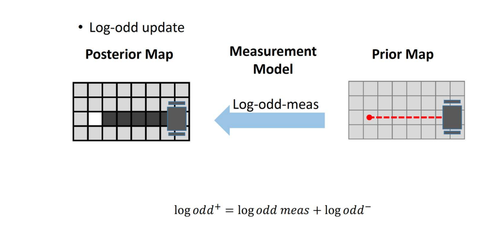

# **SLAM: Simultaneous Localization and Mapping**

## **The Problem**

In robotics, localization and mapping are two fundamental challenges:

* **Localization** : A robot needs to determine its position within a known map using sensor data.
* **Mapping** : To create a map, the robot needs to know its precise trajectory (pose) while exploring an environment.

However, this creates a  **chicken-and-egg problem** :

* **Localization requires a map** , but
* **Mapping requires knowing the robot’s location** .

#### **The Solution: SLAM**

Simultaneous Localization and Mapping ( **SLAM** ) is an approach that allows a robot to **build a map while simultaneously estimating its own position** within it. It uses sensor data (e.g., LiDAR, cameras, IMUs, and odometry) to iteratively refine both the map and the robot’s estimated trajectory.

SLAM techniques are essential for autonomous navigation, allowing robots to explore and operate in unknown environments without relying on pre-existing maps.

### Definition of the SLAM Problem

**SLAM (Simultaneous Localization and Mapping)** is the problem of estimating both the robot's trajectory and a map of the environment  **simultaneously** , using sensor data and motion commands. Let’s break it down:

#### **Outputs of SLAM**

* **Robot Poses** : The sequence of robot poses over time, denoted as ( x_{0:T} ).
* **Map of the Environment** : Denoted as ( m ).

#### Inputs to SLAM

* **Observations (( z_{1:T} ))** : Sensor measurements from devices like LIDAR, cameras, etc.
* **Controls (( u_{1:T} ))** : Robot's motion commands or odometry data between time steps.

After we defined the given parameters and the desired output that we want we can write the formula for the SLAM problem as follows:

## There is two different approaches to solving the SLAM problem

### **1- Full SLAM**

**Full SLAM** computes the complete sequence of robot poses over time, ( x_{0:T} ), along with the map ( m ), given all observations and controls. It is computationally intensive because it maintains and optimizes the entire trajectory and map.

### 2- Online SLAM

**Online SLAM** focuses on estimating only the current pose ( x_t ) and the map ( m ) without keeping track of the entire trajectory. It updates the estimate recursively as new data arrives, which is more suitable for real-time applications.

## Approaches of SLAM

## Occupancy Grid Maps

An **Occupancy Grid Map** is a probabilistic representation of the environment. It divides the environment into a grid of cells, where each cell represents a small area of space. Each cell stores a probability value indicating whether it is **occupied** (e.g., by an obstacle), **free** (open space), or  **unknown** .

Occupancy grid mapping uses the binary Bayes filter to estimate the occupancy of each cell. By incorporating sensor measurements over time, each cell's probability of being occupied or free is updated.

* **m(x,y) = {free, occupied} -> {0, 1}**
  * **m(x,y)** : This is the state of the grid cell at position (x, y). It can take two values:
  * **Black Color** `m(x,y) = 1`: The grid cell is believed to be occupied (there is an obstacle).
  * **White Color** `m(x,y) = 0`: The grid cell is believed to be free (there is no obstacle).

the gray color is not discovered area (unknown)

### Measurement Model p(z|m(x,y))

In an occupancy grid map, we are trying to estimate whether a grid cell is **occupied** or **free** based on sensor measurements.

* **z** : This is the sensor measurement (the reading from a sensor like LiDAR, sonar, or depth camera). It can take two values:
* `z = 1`: The sensor detects that the space is occupied (e.g., the sensor has "hit" an obstacle).
* `z = 0`: The sensor detects that the space is free (e.g., the sensor has not detected an obstacle).

1. **Posterior: p(m(x,y)∣z)**
   * Probability that cell (x,y) is occupied, given sensor measurement **z**.
   * This is what we want to calculate for each cell.
2. **Likelihood: p(z∣m(x,y))**
   * Probability of sensor measurement **z**, assuming cell (x,y) is occupied.
   * Models the sensor’s behavior.
3. **Prior: p(m(x,y))**
   * Initial belief about cell (x,y) being occupied (e.g., 0.5 for unknown).
4. **Evidence: p(z)**

* This is the  **probability of getting the sensor measurement z** , regardless of whether the cell is occupied or free.

Since using Bayes’ rule repeatedly is complex, We use **log-odds** to simplify the calculations.

## Resolution

The size of each grid cell in the map

* **High resolution** (small cells): More detailed maps but higher memory and computation costs.
* **Low resolution** (large cells): Less detailed maps but faster and more memory-efficient.

