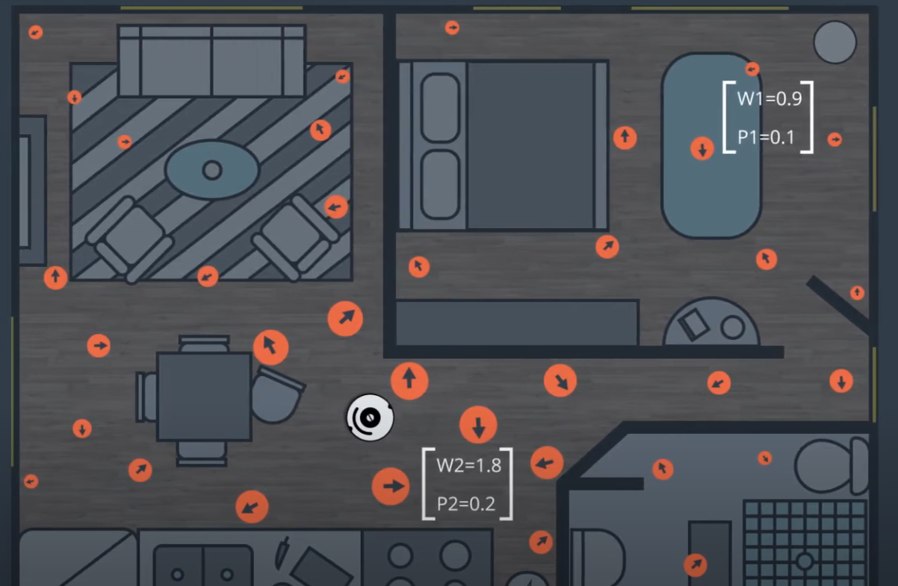
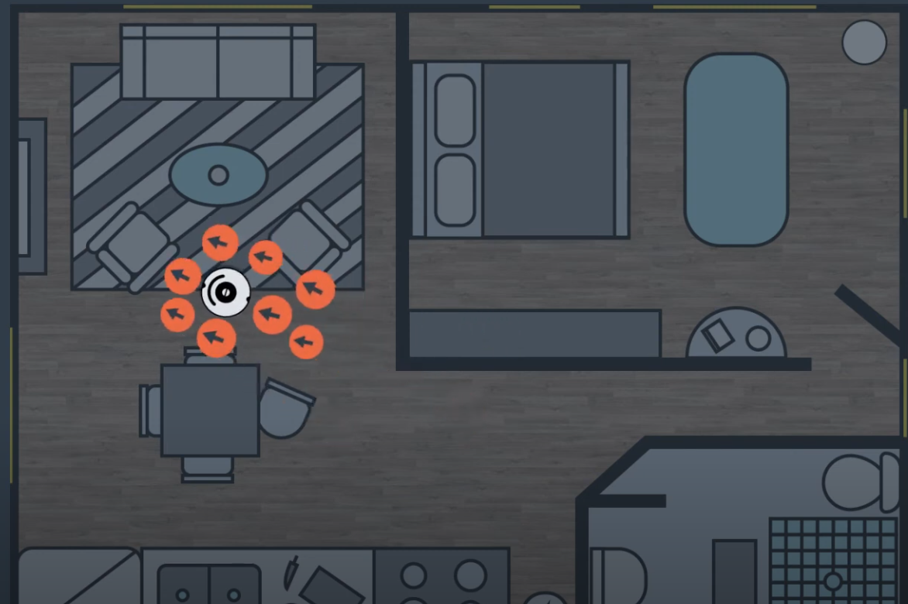
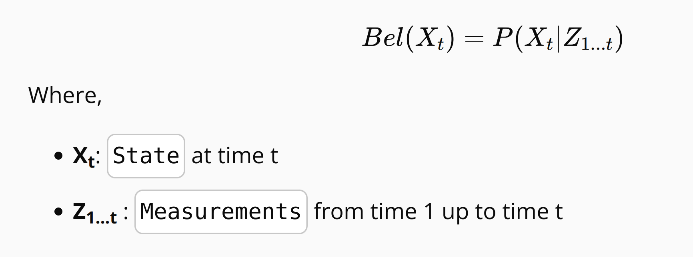
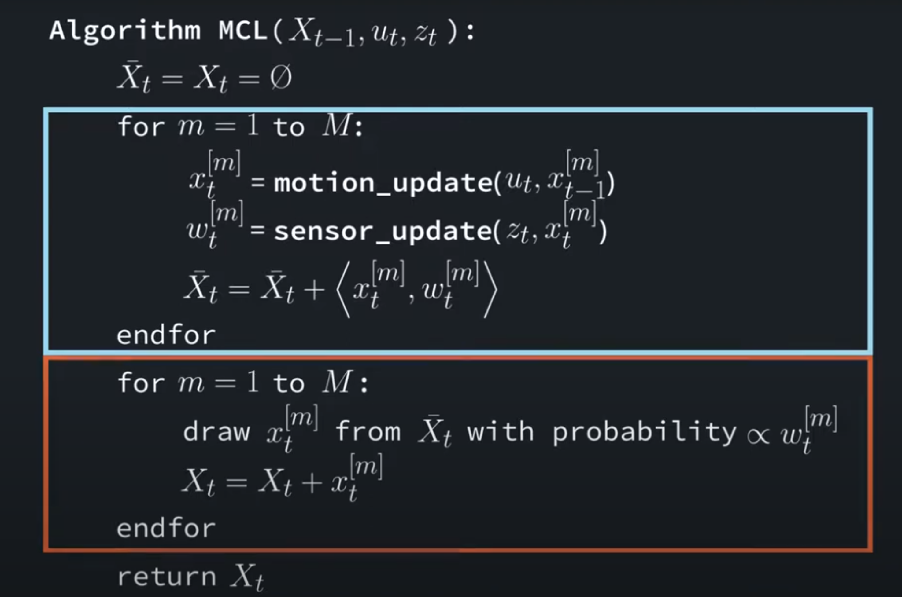
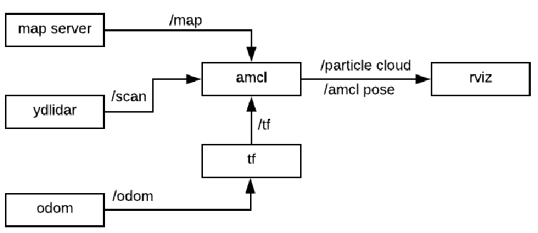

# Monte Carlo Localization (MCL)

Monte Carlo Localization (MCL) is a probabilistic algorithm used for robot localization. It is based on the **particle filter** approach, which represents the robot's belief about its position as a set of particles (hypotheses). Each particle represents a possible state (position and orientation) of the robot in the environment.


## **Problems Solved by MCL**

Monte Carlo Localization (MCL) can address both **local localization** and **global localization** problems

### **1. Global Localization**

* **problem:** The robot does not know its initial position and orientation in a known map.
* **MCL Solution:** MCL starts by spreading particles uniformly across the entire map. Each particle represents a possible pose of the robot.

### 2. **Local Localization (Pose Tracking)** :

* **Problem** : The robot knows its initial pose but needs to track its position and orientation as it moves, accounting for noise in motion and sensor data.
* **MCL Solution**: Starts with particles around the known pose. Predicts new poses using motion data and corrects using sensor data. Resamples to maintain accurate tracking.

#### Particle Filter

* A particle filter is a type of Bayesian filter that estimates the state of a system (e.g., the robot's pose) using a set of particles.
* Each particle has:
  * A  **state** : Represents the robot's pose (x, y, θ).
  * A  **weight** : Represents the likelihood of the particle being the correct state given the sensor measurements.





#### Steps of MCL

**Initialization** :

* Generate a set of particles randomly distributed over the environment.
* All particles are assigned equal weights initially.

**Prediction (Motion Update)** :

* Move each particle according to the robot's motion model (e.g., odometry).
* Add noise to account for uncertainty in the robot's motion.

**Correction (Sensor Update)** :

* Update the weight of each particle based on how well the particle's state matches the sensor measurements (e.g., laser scan or camera data).
* Particles that match the sensor data well are assigned higher weights.

**Resampling** :

* Resample the particles to focus on high-weight particles and discard low-weight particles.
* This step ensures that the particle set converges to the most likely states.

**Repeat** :

* The process is repeated iteratively as the robot moves and receives new sensor data.

## **Bayes Filter**

MCL estimates the posterior distribution of the robot's pose based on sensory information using a recursive  **Bayes filter** .

* **Goal** : Estimate the probability density over the state space conditioned on the measurements.
* The posterior probability, or  **belief** , is denoted as:



## MCL Algorithm Explanation and Pseudocode



The Monte Carlo Localization algorithm consists of two main steps in each iteration:

1. **Motion and Measurement Update** :

* **Motion Update** : For each particle, sample a new state ( x_t^{[k]} ) based on the previous state ( x_{t-1}^{[k]} ) and the control input ( u_t ) using the motion model ( p(x_t | x_{t-1}^{[k]}, u_t) ).
* **Measurement Update** : Compute the weight ( w_t^{[k]} ) of each particle based on the likelihood of the observed measurement ( z_t ) given the particle's state ( x_t^{[k]} ) using the observation model ( p(z_t | x_t^{[k]}) ).

### **The Role of Map Representation**

In MCL, the map of the environment is crucial for computing the likelihood of sensor measurements.

**Occupancy Grid Maps** :

* Represent the environment as a grid where each cell indicates the probability of being occupied.
* Used in the sensor model to compare expected measurements with actual sensor readings.

**Map Usage in MCL** :

* During the measurement update, each particle's pose is used to predict expected sensor readings based on the map.
* The difference between expected and actual sensor readings determines the particle's weight.

## **AMCL Package in ROS**

The **AMCL (Adaptive Monte Carlo Localization)** package provides the `amcl` node in ROS, which implements the MCL algorithm to track a robot's pose in a 2D space.



* **Subscriptions** :
* **Laser Scan Data** : Provides sensor measurements.
* **Map Data** : A pre-existing map of the environment.
* **Transformations (tf)** : Robot's odometry and pose estimates.
* **Publications** :
* **Estimated Pose** : The robot's estimated position and orientation in the map frame.

On startup, the `amcl` node initializes its particle filter based on provided parameters.

 **Adaptive Aspect** :

* The "Adaptive" component refers to the algorithm's ability to adjust the number of particles dynamically based on the robot's uncertainty.
* This adaptation improves efficiency by using more particles when the robot's pose is uncertain and fewer particles when the pose is well-defined.

---

### **1. Key AMCL Parameters**

AMCL parameters can be grouped into three categories:

1. **Particle Filter Parameters**: Control the behavior of the particle filter.
2. **Laser Model Parameters**: Define how laser scan data is used to update particle weights.
3. **Odometry Model Parameters**: Define how odometry data is used to predict particle motion.

---

### **2. Particle Filter Parameters**

These parameters control the initialization, resampling, and adaptation of the particle filter.

#### **`min_particles` and `max_particles`**

- Define the minimum and maximum number of particles used by the filter.
- AMCL dynamically adjusts the number of particles within this range based on the robot's uncertainty.
- Example:
  ```yaml
  min_particles: 100
  max_particles: 5000
  ```

#### **`kld_err` and `kld_z`**

- Control the **Kullback-Leibler divergence (KLD)** sampling, which adapts the number of particles based on the estimated error in the posterior distribution.
  - `kld_err`: The maximum error between the true distribution and the particle-based approximation.
  - `kld_z`: The upper standard normal quantile for the confidence level.
- Example:
  ```yaml
  kld_err: 0.01
  kld_z: 0.99
  ```

#### **`resample_interval`**

- Determines how often resampling occurs.
- Resampling too frequently can lead to particle deprivation, while resampling too infrequently can reduce accuracy.
- Example:
  ```yaml
  resample_interval: 2
  ```

#### **`recovery_alpha_slow` and `recovery_alpha_fast`**

- Control the recovery behavior when the robot loses track of its position.
  - `recovery_alpha_slow`: Slow average weight filtering factor.
  - `recovery_alpha_fast`: Fast average weight filtering factor.
- These parameters help AMCL detect and recover from localization failures.
- Example:
  ```yaml
  recovery_alpha_slow: 0.001
  recovery_alpha_fast: 0.1
  ```

---

### **3. Laser Model Parameters**

These parameters define how laser scan data is used to update particle weights.

#### **`laser_model_type`**

- Specifies the type of laser model to use. Common options are:
  - `beam`: Beam-based model.
  - `likelihood_field`: Likelihood field model (more efficient and commonly used).
- Example:
  ```yaml
  laser_model_type: likelihood_field
  ```

#### **`laser_likelihood_max_dist`**

- Defines the maximum distance to consider when computing the likelihood of a laser scan.
- Example:
  ```yaml
  laser_likelihood_max_dist: 2.0
  ```

#### **`sigma_hit`**

- Controls the standard deviation of the Gaussian noise model for laser scans.
- Example:
  ```yaml
  sigma_hit: 0.2
  ```

#### **`z_hit`, `z_short`, `z_max`, `z_rand`**

- Define the mixture weights for different components of the laser model:
  - `z_hit`: Weight for the Gaussian noise model.
  - `z_short`: Weight for unexpected obstacles (short readings).
  - `z_max`: Weight for maximum range readings.
  - `z_rand`: Weight for random noise.
- Example:
  ```yaml
  z_hit: 0.95
  z_short: 0.1
  z_max: 0.05
  z_rand: 0.05
  ```

---

### **4. Odometry Model Parameters**

These parameters define how odometry data is used to predict particle motion.

#### **`odom_model_type`**

- Specifies the type of odometry model to use. Common options are:
  - `diff`: Differential drive model.
  - `omni`: Omnidirectional drive model.
- Example:
  ```yaml
  odom_model_type: diff
  ```

#### **`alpha1`, `alpha2`, `alpha3`, `alpha4`**

- Control the noise in the odometry model:
  - `alpha1`: Noise due to rotation in rotation.
  - `alpha2`: Noise due to translation in rotation.
  - `alpha3`: Noise due to translation in translation.
  - `alpha4`: Noise due to rotation in translation.
- Example:
  ```yaml
  alpha1: 0.2
  alpha2: 0.2
  alpha3: 0.2
  alpha4: 0.2
  ```

---

### **5. Other Parameters**

#### **`update_min_d` and `update_min_a`**

- Define the minimum distance (in meters) and angle (in radians) the robot must move before performing an update.
- Helps reduce computational load by skipping updates when the robot is stationary or moving very slowly.
- Example:
  ```yaml
  update_min_d: 0.2
  update_min_a: 0.5
  ```

#### **`transform_tolerance`**

- Specifies the maximum delay (in seconds) between the timestamp of the sensor data and the current time.
- Example:
  ```yaml
  transform_tolerance: 0.1
  ```

---

### **6. Example AMCL Configuration in ROS**

Here’s an example of how these parameters might be configured in a ROS `amcl` node:

```yaml
amcl:
  min_particles: 100
  max_particles: 5000
  kld_err: 0.01
  kld_z: 0.99
  resample_interval: 2
  recovery_alpha_slow: 0.001
  recovery_alpha_fast: 0.1
  laser_model_type: likelihood_field
  laser_likelihood_max_dist: 2.0
  sigma_hit: 0.2
  z_hit: 0.95
  z_short: 0.1
  z_max: 0.05
  z_rand: 0.05
  odom_model_type: diff
  alpha1: 0.2
  alpha2: 0.2
  alpha3: 0.2
  alpha4: 0.2
  update_min_d: 0.2
  update_min_a: 0.5
  transform_tolerance: 0.1
```
