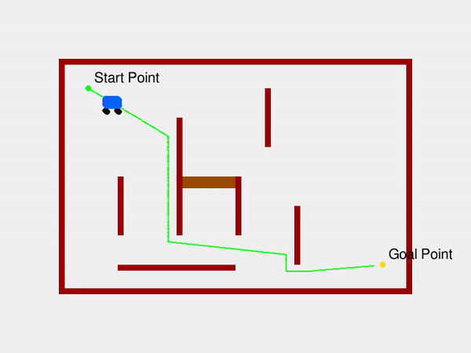

# Path Planning

## 🔍 What is Path Planning?

Path planning is like telling a robot how to go from **Point A to Point B** in an environment  **without crashing into obstacles** .

Imagine the robot is in a maze. It needs to find the **best way out** — not just any path, but the **shortest or safest** one. That's what path planning algorithms do.

---

## Applications of Path Planning

---

### 1. 🤖 **Autonomous Mobile Robots**

✅ Path planning helps them:

* Navigate from one room or shelf to another.
* Avoid obstacles like people or carts.
* Take the shortest or safest route.

### 2. 🚗 **Self-Driving Cars**

✅ Path planning here involves:

* Generating a safe and legal trajectory.
* Adapting to traffic rules.
* Reacting to dynamic obstacles (e.g., pedestrians, other cars).

  

## Path Planning Algorithms.

To achieve path planning, we need to use an **algorithm** that helps the robot search through all options and choose the best one that avoids obstacles, respects its movement limitations, and takes it safely to the goal.

Some of the most popular path planning algorithms include:

* **Dijkstra’s Algorithm**
* **A*** (A Star)

#### ✅ The algorithm must handle:

* **New obstacles:** Like a person walking in front of the robot.
* **Changing terrain:** A door that was open becomes closed.
* **Sensor updates:** LIDAR or cameras might suddenly detect something new.

#### 🧠 So the algorithm needs to:

* **Continuously monitor** the environment.
* **Re-plan on-the-fly** if the current path is blocked.
* **Be fast and reactive** , especially in crowded or uncertain spaces.

> 🧭 A* and Dijkstra are not designed for highly dynamic environments.

## Dijkstra’s Algorithm

### What It Does:

Dijkstra finds the **shortest path** between two points on a weighted graph (or grid), considering all possible paths and selecting the one with the  **least cost** .

### ✅ How It Works (Simple Steps):

1. Start from the initial node.
2. Check all reachable neighbors.
3. Assign a cost (distance) to each neighbor.
4. Choose the node with the **lowest total cost** and expand from it.
5. Repeat until the goal is reached.

> Dijkstra always explores  **the closest unvisited node** , so it’s guaranteed to find the shortest path.

### 📌 Characteristics:

* Considers **cost only**.
* Works well in known environments.
* Searches **in all directions** equally (can be slow).

## A* Algorithm

### 🧠 What Makes A* Smarter:

A* improves Dijkstra by using a **heuristic** — a smart guess of the distance to the goal.

It still finds the shortest path, but  **faster** .

A* is  **goal-directed** . It doesn’t search everywhere. It  **prioritizes nodes that look closer to the goal** .

At each step,**A*** evaluates which path to extend next based on the following formula:

### *f(**n**)**=**g**(**n**)**+**h**(**n**)*

Where:

* **n** is the current node being evaluated.
* **f**(**n**) estimated the distance from the current node **n** to reach the goal node.
* **g**(**n**) represents the **cost** of the path from the start node to node **n**.
* **h**(**n**) is the **heuristic function** , which estimates the cost from node **n** to the goal node.

### 📌 Characteristics:

* Uses  **cost + heuristic** .
* Explores  **toward the goal** , not everywhere.
* **Faster than Dijkstra** .

## 🔄 Dijkstra vs A* (Comparison)

| Feature            | Dijkstra        | A*                                  |
| ------------------ | --------------- | ----------------------------------- |
| Uses cost (g)      | ✅ Yes          | ✅ Yes                              |
| Uses heuristic (h) | ❌ No           | ✅ Yes                              |
| Search direction   | Everywhere      | Toward goal                         |
| Speed              | Slower          | Faster (with good heuristic)        |
| Optimal path       | ✅ Yes (always) | ✅ Yes (if heuristic is admissible) |

Perfect! Here’s how you can **introduce the Dynamic Window Approach (DWA)** to your students in a simple and engaging way, especially after teaching path planning and A*:

---

## 🚀 Now Let’s Talk About: **Dynamic Window Approach (DWA)**

We’ve already seen how path planning algorithms like **Dijkstra** and **A*** help the robot figure out  **where to go** .

But once the robot knows  **the path** , it still needs to answer:

> **"How exactly should I move my wheels at every moment to follow that path, avoid obstacles, and stay safe?"**

That’s where the **Dynamic Window Approach** comes in.

---

### 🤖 What is the Dynamic Window Approach (DWA)?

> DWA is a **local planner** that helps the robot decide the best motion (velocity and direction)  **at every moment** , considering:

* The robot’s **speed** and **acceleration limits**
* The robot’s ability to **turn**
* The **obstacles** around it
* The **path** planned by A*

---

### 🧠 In Simple Words:

> “DWA is an algorithm that chooses the best movement the robot can make  **right now** , so it can safely follow the planned path.”

---

## 🔍 How It Works (Step-by-Step):

1. **Generate Velocity Commands**
   * The robot calculates different velocity options based on how fast it can go and how quickly it can turn. This set of possible movements is called the  **dynamic window** .
2. **Simulate Each Option**
   * For each velocity, the robot simulates where it would end up if it moved that way for a short time.
3. **Score Each Option**
   * It scores each one based on:
     * How **safe** it is (avoids obstacles)
     * How **close** it gets to the goal
     * How **well** it follows the path
4. **Pick the Best One**
   * The robot picks the highest-scoring option and moves accordingly.

---

### 📦 Why It’s Called “Dynamic Window”:

Because it only considers **movements that are dynamically possible** for the robot  **at that moment** , based on its current velocity and acceleration limits.
