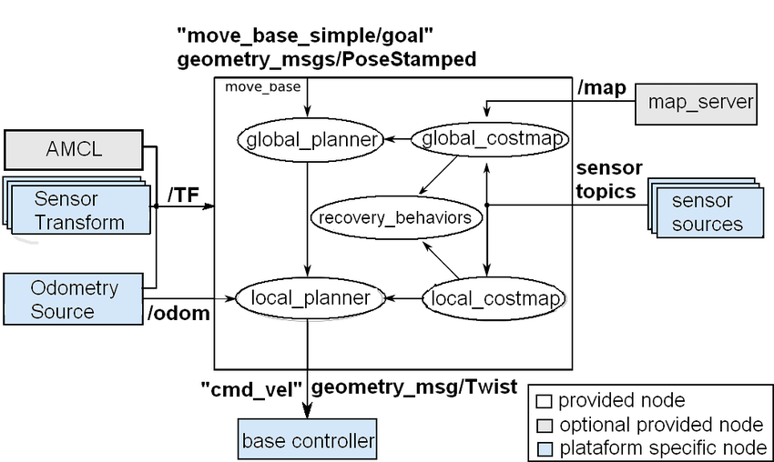

# Navigation Stack ROS

The Navigation Stack in ROS (Robot Operating System) is a collection of software packages used for autonomous robot navigation. It is designed to help robots move from one location to another while avoiding obstacles in their path.
The Navigation Stack consists of several components:

## 1- Localization

This component helps the robot determine its position in the environment. It uses sensors such as GPS, IMU, or visual odometry to estimate the robot's pose.

## 2- Mapping

This component creates a map of the environment by processing data from various sensors. The map is used by the robot to plan its path.

## 3- Path Planning

This component plans a collision-free path from the robot's current position to its destination. It takes into account the robot's size, the obstacles in the environment, and other constraints

## 4- Obstacle Avoidance

This component sends commands to the robot's motors to execute the planned trajectory.

## How to use this Navigation Stack?

To use the Navigation Stack in ROS, the robot must be equipped with sensors such as a laser range finder or a depth camera for obstacle detection and localization. The robot must also have actuators such as motors for movement control.

### **Overview**

The diagram depicts the **data flow** and **node interactions** in the ROS Navigation Stack. Key components include:

* **`move_base`** (central coordinator)
* **`AMCL`** (localization)
* **Global & Local Planners** (path planning)
* **Costmaps** (obstacle representation)
* **Sensor inputs** (LIDAR, odometry, etc.)
* **Output** (`cmd_vel` to the robot’s motors)



## What is the move_base node

* The move_base node is a key component of the Navigation Stack in ROS. It provides a high-level interface for controlling the movement of a robot in a 2D environment, based on a map of the environment and sensor data such as laser range finder or depth camera readings.
* The move_base node uses a combination of global and local path planning algorithms to navigate the robot towards a goal location while avoiding obstacles. The global planner generates a path from the robot's current location to the goal location, while the local planner adjusts the robot's trajectory to avoid obstacles and reach the goal.

## How the move_base node works

* The move_base node in ROS works by using a combination of global and local path planning algorithms to navigate the robot towards a goal location while avoiding obstacles.
  Here's an overview of how the move_base node works:

### 1- Global Planning:

The move_base node first generates a global path from the robot's current location to the goal location using a global planner. The global planner takes into account the robot's current
position, the goal location, and the map of the environment, and generates a plan to move the robot to the goal while avoiding obstacles.

### 2- Local Planning:

 Once the global path has been generated, the move_base node uses a local planner to adjust the robot's trajectory and avoid obstacles in real-time. The local planner
continually updates the robot's trajectory based on the sensor readings and other information about the environment.

### 3- Obstacle Avoidance:

The move_base node uses a combination of sensor data, such as laser range finder or depth camera readings, and a costmap to avoid obstacles in the environment. The costmap
is a 2D grid that assigns a cost to each cell based on the likelihood of the cell being occupied by an obstacle. The move_base node then plans a path that minimizes the cost and avoids obstacles.

### 4- Localization:

The move_base node uses various techniques for localization, such as laser range finders and odometry, to accurately determine the robot's position and orientation in the
environment. This information is used by the global and local planners to generate a path plan that moves the robot towards the goal location.

### 5- Motor Control:

Once the path has been generated, the move_base node sends commands to the robot's motor or actuator controllers to move the robot towards the goal location.

---

## Global-planner move base

* The global planner in move_base is responsible for generating a global plan from the robot's current location to a goal location, while avoiding obstacles in the environment. The global planner can use different algorithms to generate the path plan, such as Dijkstra's algorithm, A* search algorithm.
* The planner takes into account the map, the robot's size and shape, and any known obstacles or restricted areas in the environment.
* Once the global planner has generated a path plan, it sends the plan to the local planner in move_base. The local planner is responsible for adjusting the robot's trajectory to avoid obstacles and follow the path plan generated by the global planner. The local planner uses sensor readings such as laser range finder or depth camera data to generate a plan that is optimized for the robot's current location and orientation.

## Local-planner move base

* The local planner in move_base is responsible for adjusting the robot's trajectory to avoid obstacles and follow the global path plan generated by the global planner.
* The local planner takes into account the robot's current position and orientation, as well as sensor readings such as laser range finder or depth camera data, to generate a trajectory that avoids obstacles in the environment and follows the global path plan.
* The local planner uses a variety of algorithms to generate this trajectory, such as Dynamic Window Approach (DWA) or Timed Elastic Band (TEB).

## Costmap-2D move base

* The costmap-2D is a grid-based representation of the environment used by the move_base node in ROS to plan paths and avoid obstacles.
* The costmap-2D assigns a cost to each cell in the grid, representing the likelihood that the cell is occupied by an obstacle.

### 1- Global costmap

* The global costmap in move_base is a grid-based representation of the environment used by the global planner to generate a high-level path plan that takes into account obstacles and other constraints in the environment.
* The global costmap is typically generated using sensor data such as laser range finder or depth camera data. The sensor data is used to create a 2D occupancy grid map, where each  cell in the grid represents a small area of the environment. Each cell is assigned a cost based on the likelihood that it is occupied by an obstacle

### 2- Local costmap

* In addition to the global costmap, the move_base node in ROS also uses a local costmap to assist the local planner in avoiding obstacles and generating safe trajectories.
* The local costmap is a smaller grid-based representation of the environment that surrounds the robot. It is used by the local planner to generate trajectories that avoid obstacles in the immediate vicinity of the robot.
* The local costmap is typically generated using the same sensors that are used to generate the global costmap, such as laser range finders or depth cameras. However, the local costmap only covers a smaller area around the robot, typically within a few meters.

## rotate-recovery move base

* The rotate recovery behavior in move_base is a part of the move_base recovery behaviors package, which provides a set of recovery behaviors that the robot can use when it gets stuck or encounters unexpected obstacles.
* The rotate recovery behavior is used when the robot is unable to move forward and is stuck. The behavior works by rotating the robot in place until it finds a clear path to move forward. The behavior rotates the robot at a constant rate for a specified amount of time or until it detects that the robot has rotated enough to clear the obstacle.

# Navigation Stack Configuration Files

Here’s a fully commented version of each configuration file, with inline explanations for every parameter:

---

### **1. costmap_common_params.yaml**

```yaml
# === Robot Geometry ===
robot_radius: 0.25          # Radius (meters) of a circular robot. Set to 0 if using footprint.
footprint_padding: 0.1       # Extra padding (meters) around the robot's footprint for safety.

# Uncomment to define a custom polygon footprint (for non-circular robots):
# footprint: [[x1,y1], [x2,y2], ...]  

# === Laser/Obstacle Layer ===
laser_layer:
  observation_sources: scan   # Laser scan topic(s) for obstacle detection
  scan:
    data_type: LaserScan      # Message type (LaserScan/PointCloud2)
    topic: scan               # Topic name (match your sensor topic)
    marking: true             # Enable adding obstacles to costmap
    clearing: true            # Enable clearing free space via raycasting
    min_obstacle_height: 0.05 # Min height (m) to consider as obstacle
    max_obstacle_height: 0.35 # Max height (m) to consider as obstacle
    obstacle_range: 4.0       # Max range (m) to mark obstacles
    raytrace_range: 5.0       # Max range (m) to clear obstacles (raycasting)

# === Inflation Layer (Safety Margins) ===
inflation_layer:
  enabled: true               # Enable cost inflation around obstacles
  cost_scaling_factor: 2.58   # Exponential decay rate of cost values (higher = steeper dropoff)
  inflation_radius: 0.8       # Distance (m) from obstacles where costs are applied

# === Static Map Layer ===
static_layer:
  enabled: true               # Enable pre-loaded map
  map_topic: map              # Topic providing the static map (from map_server)
  track_unknown_space: true   # Treat unknown areas as obstacles if true
```

---

### **2. global_costmap_params.yaml**

```yaml
global_costmap:
  global_frame: map           # Frame ID of the global map (usually "map")
  robot_base_frame: base_footprint  # Frame ID of robot base
  update_frequency: 1.0       # Update rate (Hz) of the costmap
  transform_tolerance: 3.5    # Time (sec) to wait for TF transforms

  # === Costmap Behavior ===
  rolling_window: false       # If true, costmap moves with robot (local mode)
  publish_frequency: 0.5      # Rate (Hz) to publish visualization

  # === Plugin Layers ===
  plugins:
    - {name: static_layer, type: "costmap_2d::StaticLayer"}    # Pre-loaded map
    - {name: laser_layer, type: "costmap_2d::ObstacleLayer"}   # Dynamic obstacles
    - {name: inflation_layer, type: "costmap_2d::InflationLayer"}  # Safety margins
```

---

### **3. local_costmap_params.yaml**

```yaml
local_costmap:
  global_frame: odom          # Frame for local planning (usually "odom")
  robot_base_frame: base_footprint
  update_frequency: 1.0       # Higher than global costmap (5-15Hz recommended)
  publish_frequency: 5.0      # Visualization update rate (Hz)
  
  # === Rolling Window Mode ===
  rolling_window: true        # Costmap follows robot (required for local planning)
  width: 2.5                  # Width (m) of costmap window
  height: 2.5                 # Height (m) of costmap window
  resolution: 0.05            # Grid resolution (m/cell)

  # === Plugin Layers ===
  plugins:
    - {name: laser_layer, type: "costmap_2d::ObstacleLayer"}   # Dynamic obstacles
    - {name: inflation_layer, type: "costmap_2d::InflationLayer"}  # Safety margins
```

---

### **4. global_planner_params.yaml**

```yaml
GlobalPlanner:
  # === Algorithm Selection ===
  use_dijkstra: false         # False = A* (faster), True = Dijkstra (more optimal)
  allow_unknown: true         # Allow planning through unknown map areas

  # === Cost Scaling ===
  lethal_cost: 253            # Cost value considered lethal (obstacle)
  neutral_cost: 11            # Base cost for free space
  cost_factor: 0.65           # Weight multiplier for costmap values

  # === Goal Tolerance ===
  xy_goal_tolerance: 0.4      # Allowed XY error (m) when reaching goal
  publish_potential: true      # Publish potential field visualization
```

---

### **5. dwa_local_planner_params.yaml**

```yaml
DWAPlannerROS:
  # === Robot Dynamics ===
  max_vel_x: 0.5              # Max forward velocity (m/s)
  min_vel_x: 0.0              # Min forward velocity (m/s)
  max_vel_theta: 0.5          # Max rotational velocity (rad/s)
  acc_lim_x: 1.6              # Max acceleration (m/s²)

  # === Goal Tolerance ===
  xy_goal_tolerance: 0.4      # Allowed XY error (m)
  yaw_goal_tolerance: 0.2     # Allowed angular error (rad)

  # === Trajectory Scoring ===
  path_distance_bias: 64      # Weight for following global path (higher = stick closer)
  goal_distance_bias: 24       # Weight for reaching goal (higher = prioritize goal)
  occdist_scale: 0.01          # Weight for obstacle avoidance (higher = more clearance)

  # === Simulation Parameters ===
  sim_time: 4.0               # Time (sec) to simulate trajectories
  vx_samples: 40              # Number of velocity samples for forward motion
  vth_samples: 20             # Number of velocity samples for rotation
```

---
