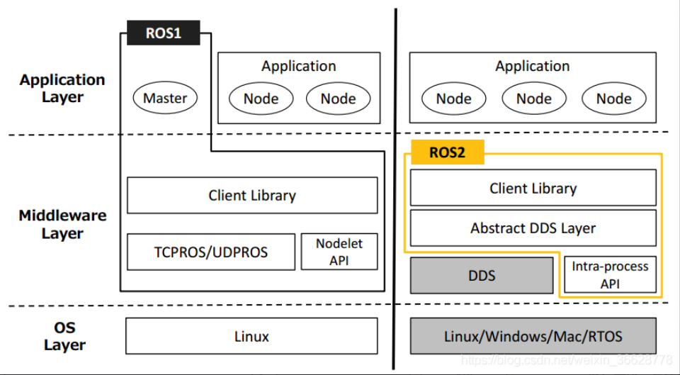

# **ROS1 vs ROS2: Key Differences**

---

## **1. Platform Support**

| Feature              | ROS1                          | ROS2                                             |
| -------------------- | ----------------------------- | ------------------------------------------------ |
| **Primary OS** | Ubuntu (officially supported) | Ubuntu, Windows 10, macOS (officially supported) |

### **Key Takeaway:**

- **ROS2 is more cross-platform** (Windows, macOS, Linux).
- Better for **embedded & real-time systems**.

---

## **2. Middleware & Communication**

| Feature                          | ROS1                     | ROS2                                      |
| -------------------------------- | ------------------------ | ----------------------------------------- |
| **Communication Protocol** | Custom TCP/UDP           | **DDS (Data Distribution Service)** |
| **Discovery Mechanism**    | Centralized (ROS Master) | **Decentralized (No Master)**       |

### **Key Takeaway:**

- **ROS2 removes dependency on ROS Master** (no single point of failure).
- **DDS provides better real-time & network performance**.



---

## **3. Build System (Catkin vs Ament)**

| Feature                | ROS1 (Catkin) | ROS2 (Ament)                              |
| ---------------------- | ------------- | ----------------------------------------- |
| **Build System** | CMake only    | Supports**CMake & Python packages** |
| **Devel Space**  | Yes           | No devel space (must install)             |

### **Key Takeaway:**

- **Ament is more flexible** (supports non-CMake projects).
- **No devel space** forces better packaging practices.

---

## **4. Nodes & Execution Model**

| Feature                  | ROS1                     | ROS2                             |
| ------------------------ | ------------------------ | -------------------------------- |
| **Node Lifecycle** | ❌ No standard lifecycle | ✅**Lifecycle management** |

### **Key Takeaway:**

- **ROS2 supports real-time & better threading control**.
- **Lifecycle management** improves system reliability.

---

## **5. Tools & Launch System**

| Feature             | ROS1                      | ROS2                              |
| ------------------- | ------------------------- | --------------------------------- |
| **roslaunch** | XML-based (limited logic) | **Python-based (flexible)** |

- **ROS2 launch files are Python scripts** (more powerful).
- **Faster resource lookup** with indexing.

---

## 📊 Summary Table

| Feature                      | ROS 1                               | ROS 2                           |
| ---------------------------- | ----------------------------------- | ------------------------------- |
| **Communication**      | **TCPROS/UDPROS with master** | **DDS without master**    |
| **Real-Time Support**  | **Limited**                   | **Supported**             |
| **Platform Support**   | **Linux**                     | **Linux, Windows, macOS** |
| **Security**           | None                                | **DDS Security**          |
| **Node Lifecycle**     | **Not available**             | **Managed lifecycles**    |
| **Quality of Service** | **Not available**             | **Supported**             |
| **Build System**       | **catkin**                    | **colcon**                |
| **Development Status** | **Maintenance (until 2025)**  | **Active development**    |

---

# **ROS2: Essential Commands**

---

## **1. Core ROS2 Commands**

### **Workspace & Build Commands**

| Command                                       | Description                      |
| --------------------------------------------- | -------------------------------- |
| `mkdir -p ~/ros2_ws/src`                    | Create a ROS2 workspace          |
| `cd ~/ros2_ws`                              | Navigate to workspace            |
| `colcon build`                              | Build all packages in workspace  |
| `colcon build --packages-select <pkg_name>` | Build a specific package         |
| `colcon build --symlink-install`            | Build with symlinks (faster dev) |
| `source install/setup.bash`                 | Source the workspace             |

### **Running Nodes**

| Command                                            | Description               |
| -------------------------------------------------- | ------------------------- |
| `ros2 run <pkg_name> <executable>`               | Run a node from a package |
| `ros2 launch <pkg_name> <launch_file.launch.py>` | Run a launch file         |

---

## **2. ROS2 Node & Topic Commands**

### **Node Management**

| Command                        | Description            |
| ------------------------------ | ---------------------- |
| `ros2 node list`             | List all running nodes |
| `ros2 node info <node_name>` | Get info about a node  |

### **Topic Commands**

| Command                                           | Description                       |
| ------------------------------------------------- | --------------------------------- |
| `ros2 topic list`                               | List all active topics            |
| `ros2 topic echo <topic_name>`                  | Print messages from a topic       |
| `ros2 topic info <topic_name>`                  | Get topic info (type, publishers) |
| `ros2 topic pub <topic_name> <msg_type> <data>` | Publish to a topic                |
| `ros2 topic hz <topic_name>`                    | Check publishing rate             |

---

## **3. ROS2 Service & Parameter Commands**

### **Service Commands**

| Command                                                | Description                 |
| ------------------------------------------------------ | --------------------------- |
| `ros2 service list`                                  | List all available services |
| `ros2 service call <service_name> <srv_type> <args>` | Call a service              |

### **Parameter Commands**

| Command                                             | Description           |
| --------------------------------------------------- | --------------------- |
| `ros2 param list`                                 | List all parameters   |
| `ros2 param get <node_name> <param_name>`         | Get a parameter value |
| `ros2 param set <node_name> <param_name> <value>` | Set a parameter       |

---

## **4. ROS2 Bag (Recording & Playback)**

| Command                               | Description                 |
| ------------------------------------- | --------------------------- |
| `ros2 bag record <topic1> <topic2>` | Record topics to a bag file |
| `ros2 bag play <bag_file>`          | Play back recorded data     |
| `ros2 bag info <bag_file>`          | Get info about a bag file   |

---

## **5. ROS2 Interface  Commands**

### **Message/Service/Action Inspection**

| Command                               | Description                | ROS1 Equivalent                   |
| ------------------------------------- | -------------------------- | --------------------------------- |
| `ros2 interface list`               | List all interfaces        | `rosmsg list` + `rossrv list` |
| `ros2 interface list \| grep "msg/"` | List only messages         | `rosmsg list`                   |
| `ros2 interface list \| grep "srv/"` | List only services         | `rossrv list`                   |
| `ros2 interface show <type>`        | Show interface definition  | `rosmsg/rossrv show`            |
| `ros2 interface package <pkg>`      | List interfaces in package | `rosmsg package`                |

# **ROS2 Turtlesim Practice Guide:**

## **1. Setup & Basic Commands**

### **Start Turtlesim**

```bash
# Terminal 1 - Start simulator
ros2 run turtlesim turtlesim_node

# Terminal 2 - Start keyboard control
ros2 run turtlesim turtle_teleop_key
```

*Use arrow keys to move turtle*

### **Core System Inspection**

```bash
# List active nodes
ros2 node list
# Output: /turtlesim, /teleop_turtle

# Get node details
ros2 node info /turtlesim
# Shows publishers, subscribers and services
```

## **2. Topic Operations**

### **Topic Monitoring**

```bash
# List all topics
ros2 topic list
# /turtle1/cmd_vel, /turtle1/pose, /rosout

# Echo turtle position
ros2 topic echo /turtle1/pose
# Continuously prints x,y,theta values

# Get topic info
ros2 topic info /turtle1/cmd_vel
# Shows message type and connection counts

# Check publishing rate
ros2 topic hz /turtle1/pose
# Shows ~60Hz update rate
```

### **Manual Topic Publishing**

```bash
# Make turtle move in circles
ros2 topic pub -r 1 /turtle1/cmd_vel geometry_msgs/msg/Twist "{linear: {x: 2.0}, angular: {z: 1.0}}"
```

## **3. Service Operations**

### **Service Exploration**

```bash
# List available services
ros2 service list
# /clear, /kill, /reset, /spawn, /turtle1/set_pen

# Get service type
ros2 service type /spawn
# Output: turtlesim/srv/Spawn

# Show service definition
ros2 interface show turtlesim/srv/Spawn
```

### **Service Calls**

```bash
# Spawn new turtle
ros2 service call /spawn turtlesim/srv/Spawn "{x: 5.0, y: 5.0, theta: 0.0, name: 'turtle2'}"

# Change pen color (red)
ros2 service call /turtle1/set_pen turtlesim/srv/SetPen "{r: 255, g: 0, b: 0, width: 3, off: 0}"

# Clear drawing
ros2 service call /clear std_srvs/srv/Empty
```

## **4. Recording with ros2 bag**

```bash
# Record turtle movements
ros2 bag record /turtle1/cmd_vel /turtle1/pose

# Playback recording
ros2 bag play rosbag2_2023_10_15-10_00_00
```

### **5. Interface Inspection**

### **Message Analysis**

```bash
# List all message types
ros2 interface list | grep "msg/"

# Show Pose message structure
ros2 interface show turtlesim/msg/Pose

# List all turtlesim interfaces
ros2 interface package turtlesim
```
